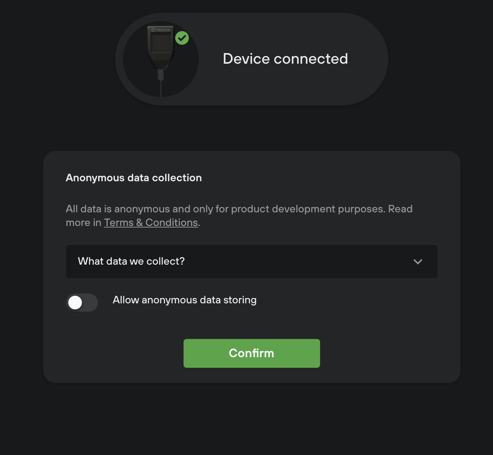
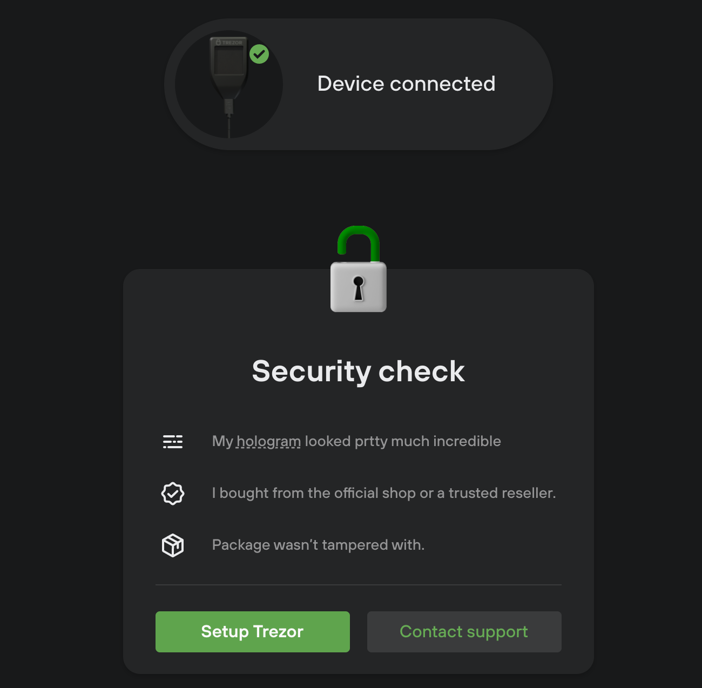

# Onboarding

_Incomplete developers guide to Onboarding in Trezor Suite_

There are few different ways to trigger the onboarding process:

-   Initial run
    -   Initial run is what we call a state when Suite is launched for the first time. It may also be triggered by clearing the app storage (flag is stored inside a reducer `suite.flags.initialRun` and saved to persistent storage). This is stored per device. If Suite detects initial run it'll automatically launch the onboarding.
-   Connecting an uninitialized device (without a seed)
    -   Suite will automatically launch the onboarding
-   Wiping a device from Suite UI and proceeding with device setup

## Prerequisites

### Button Requests

Each `device` object inside has its `buttonRequests` array which gets populated through `buttonRequestMiddleware`. It it basically a way for a device to request cooperation from the app.

It is used, for example, by firmware update flow for setting correct `firmware.status` after device requested confirmation on the device:

```js
case SUITE.ADD_BUTTON_REQUEST:
      if (action.payload.code === 'ButtonRequest_FirmwareUpdate') {
          draft.status = 'waiting-for-confirmation';
      }
```

Another usage is in "Setup Pin" step, where the device, through button request, will let us know if user should enter pin for the first time or 2nd time (for confirmation). It is also leveraged outside of Onboarding every time user needs to enter a PIN. Thanks to these buttons we can reuse the same component that will adjust just based on these button requests.

In onboarding, we clear this array after each step (handled in `buttonRequestMiddleware`).

## Steps

-   [Welcome](#Welcome)
    -   [Data analytics](<###Data-analytics-(only-in-initial-run)>)
    -   [Device security (genuinity) check](<###Device-security-(genuinity)-check>)
-   [Firmware](##Firmware)
    -   Note about normal and bootloader mode
    -   Firmware update or installation
    -   Device with older firmware installed
    -   Device with no firmware installed
    -   State of currently shipped devices, intermediary firmware
-   [Generating seed](##Generating-seed)
    -   [Generating new seed](###Generating-new-seed)
    -   [Recovery from mnemonic](###Recovery-from-mnemonic)
-   [Backup seed](##Backup-seed)
-   [PIN Setup](##PIN-setup)
-   [Suite Settings](##Suite-Settings) (enabled coins, custom backends, TOR)
-   [Final step](##Final-step) (device label, homescreen)

## Welcome

### Before a user connects a device

As a first step we prompt the user to connect his device in normal mode.
In this step we handle various invalid device modes and problems with transport layer used to facilitate communication with the device (webUSB, Trezor Bridge).

#### List of valid states

-   Waiting for a device
    -   We provide some troubleshooting tips and link to download Trezor Bridge as it may happen that user launched Suite for the first time without installing Trezor Bridge (only in Web environment)
        
-   Device connected in normal mode
    -   Part of happy path. After the device is connected we proceed to [Data analytics (only in initial run)](<###Data-analytics-(only-in-initial-run)>) or to [Device security (genuinity) check](<###Device-security-(genuinity)-check>)

#### List of invalid states

Invalid device states:

-   Device connected, but in bootloader mode
-   Device connected, but unreadable
-   [Seedless device setup](https://trezor.io/learn/a/seedless-setup) is not supported in Suite (not to be confused with regular device without seed).

Invalid transport states:

-   No transport available (Trezor Bridge is not running)
    -   We need to provide link to download Trezor Bridge (only in Web environment)

### Data analytics (only in initial run)

During the initial run we ask users to give their consent to collect and process anonymous data in order to help us improve the user experience.



### Device security (genuinity) check

This sub step is adjusted based on a state of the device. We distinguish between device that was already used before (it has a firmware installed) and most likely unused device (no seed, no firmware).



#### Device without seed, no firmware installed

This should be the most common case in onboarding.

Scenario:

-   New device bought from trusted seller
-   User wiped the device (and firmware)

Security questions: Check hologram, verify seller, check package...

Primary action: Setup device (starts onboarding)

Secondary action: Contact support

#### Device without seed, firmware already installed

Scenario:

-   User has wiped the device (without erasing a firmware)
-   Device has been tampered with

Security questions: Have the user used the device before?

Primary action: Setup device (starts onboarding)

Secondary action: Contact support

#### Device with seed (thus also a firmware)

Scenario:

-   User cleared app storage so the onboarding was started on initial run.
-   Device has been tampered with

Security questions: Have the user used the device before?

Primary action: Setup device (starts onboarding)

Secondary action: Contact support

## Firmware

To provide good user and dev experience firmware flow has its own reducer. It is shared between firmware flow used in onboarding and standalone modal for firmware update. Both flows,fw installation via onboarding and firmware update via standalone modal, reuse same components.

Active sub step of firmware step is stored in `status` field. Explanation of each field and sub steps can be found in [firmwareReducer.ts](https://github.com/trezor/trezor-suite/blob/develop/packages/suite/src/reducers/firmware/firmwareReducer.ts).

### Note about normal and bootloader mode

Device can be connected in “normal” mode or in “bootloader" mode which you access by pressing left button on T1B1/T2B1 (both buttons on old T1B1 fw) or swiping on touchscreen in case of T2T1 during connecting usb cable to the device. Before starting the installation process, user needs to disconnect the device and reconnect it in bootloader mode.

From the technical perspective, these two modes are seen as 2 different devices and there is no way we can tell that the device, which was reconnected in bootloader mode is indeed the same device which was before connected in normal mode. This basically means that if you are updating a firmware with a device connected via webUSB you will need to do pairing process twice.
When device is in bootloader mode `device.features.major_version`, `device.features.minor_version`, `device.features.patch_version` is version of a bootloader, not a firmware.

Another interesting fact is that a device without installed firmware acts as it is in bootloader mode regardless of buttons you are or you are not pressing (device has always some bootloader installed).

Bootloader mode has another catch, not all device's features are accessible while a device is in this state. Such inaccessible fields are set to `null`. For example, `device.features.pin_protection` is set to `null`, but that doesn't mean that device has this feature disabled. After reconnecting the same device in normal mode `pin_protection` might be set `true` (or `false`).

This is the reason why, in Welcome step, we force the user to connect a device in normal mode first. Otherwise we wouldn't know what firmware version is installed or what firmware update we can offer.

### Firmware installation

Device could be in various states when the user enters this step.

-   Firmware not installed
    -   Fresh device (`device.firmware` set to `none`)
    -   We don't need to prompt the user to switch to bootloader mode in this case.
-   Firmware already installed and:
    -   Update available: It can be optional (skip button is present) or mandatory. Be aware that a device, while in bootloader mode, doesn’t report its fw version, only version of bootloader.
    -   Latest firmware already installed (just wiped seed)

Possible error states:

-   Generic firmware installation fail
    -   User cancelled installation on a device
    -   Device disconnected during the process
    -   Some unexpected error
-   Device is connected in bootloader mode from the start
    -   We will prompt the user to connect device in normal mode
    -   This won't happen in Onboarding so much, but it is handled as this firmware flow is used in standalone firmware update modal which can be triggered from Suite
-   Device disconnected before firmware installation starts
    -   Prompt the user to reconnect the device
-   Device disconnected after firmware installation starts
    -   Installation will fail with generic error
    -   This could happen when a cable is not connected properly and the device will disconnect during the process

#### Device with older firmware installed


If device is connected in normal mode and user proceeds by clicking “install firmware” we will ask the user to disconnect the device
and reconnect it in bootloader mode (via a small modal popup).


After the device is reconnected we show a button to trigger an update process. Then the device will request a confirmation from the user. Only after the user confirms it the installation begins.


#### Device with no firmware installed

User proceeds by clicking "Install firmware" CTA. Since the device without firmware is always in bootloader mode we don't need any cooperation from the user. Device doesn't ask for confirming the installation of the fw. When firmware installation is completed `firmware.status` is set to `unplug` in case of T1B1, for T2T1/T2B1 it it set to `wait-for-reboot`. User of T1B1 is prompted to disconnect the device and reconnect it in normal mode. T2T1/T2B1 automatically restarts itself. Then we continue to the next step ([Generating seed](##Generating-seed))


#### State of currently shipped devices

##### Intermediary firmware

T1B1 devices with old bootloader cannot be upgraded to latest firmware directly. First we'll install so called intermediary firmware, which will bump bootloader to newer version. After installation is completed, the user will be asked to reconnect the device. Because intermediary firmware only bumps bootloader and doesn't install any firmware, device will be in bootloader mode regardless of how the user reconnects it (whether they press a button or not). Then it triggers an installation of subsequent firmware, which will be the latest firmware available. It will follow basically the same flow as with the first installation.

##### WebUSB

Support for the WebUSB came pretty late for T1B1 (bootloader [1.6.0](https://github.com/trezor/trezor-firmware/blob/main/legacy/bootloader/CHANGELOG.md#160-september-2018) bundled with FW [1.7.1](https://github.com/trezor/trezor-firmware/blob/main/legacy/firmware/CHANGELOG.md#170-september-2018)). Currently shipped devices won't support WebUSB out of-the-box and user won't be able to pair such device. In this case user needs to install Trezor Bridge. After finishing fw upgrade WebUSB support will be available.

#### Caveats

##### UI.FIRMWARE_PROGRESS

-   Devices won’t dispatch any event after the user confirms the installation on a device. We only detect that the installation has started when we receive `UI.FIRMWARE_PROGRESS` which is triggered about 10 seconds too late.
-   T1B1 sends `UI.FIRMWARE_PROGRESS` only twice, at 0% and then at 100%. However progress bar runs smoothly, that is because we are faking a progress. There are carefully set durations of fake progress bar. When fake progress reaches certain barrier (eg. 90%) it will stop and wait for progress report from `UI.FIRMWARE_PROGRESS`. Also when this event reports greater progress than the fake one, it will take the precedence.
-   Faking a progress is also used on T2T1/T2B1 because, on device without any firmware installed, first `UI.FIRMWARE_PROGRESS` is received too late. (Only variant where we rely completely on a real progress is when we are upgrading T2T1 from older firmware).

##### Remembered wallet, multiple devices

The onboarding inherited few bugs from its predecessor. After the installation of a firmware user is asked to reconnect his device (T1B1) or the device is auto restarted (T2T1/T2B1). To prevent Suite from selecting another device while the one we use was disconnected, we force remembering the device (and storing it to persistent storage).
However this doesn't work in case of freshly unpacked device (or device with wiped fw), which are in bootloader mode from the start and cannot be "remembered".

When this happens Suite will try to select another available device, which will be the other connected device or remembered wallet and there is no way ho to switch the device back unless you restart the app/refresh the page.

To work around this in `suiteActions.onHandleDisconnect`, before selecting the next active device, we check if we are in Onboarding (or standalone firmware update flow) and if so we won't allow switching selected device to different one.

## Generating seed

User chooses between generating a new seed or seed recovery.

### Generating new seed

-   Single seed
-   Shamir (only available on T2T1/T2B1)

At first it might seem that both options are doing exactly the same, real difference between these two will present itself in [Backup seed step](##Backup-seed)

### Recovery from mnemonic

#### T2T1/T2B1

The entire process is done on device. All we need to do in Suite UI is to show generic "Confirm on your Trezor" bubble.

#### T1B1

For T1B1 there are two things the user needs to decide:

1. Does the user want to recover from 12, 28 or 24 words?
2. Does the user want to enter the seed by selecting words in Suite UI (Standard recovery) or he/she wants the most secure environment and will enter the words via keyboard matrix shown on the device (advanced recovery)?

## Backup seed

User needs to confirm that the seed will be safe, there will be no digital copy of it. Then he can start the process on a device.

#### T2T1/T2B1

The entire process is done on device. All we need to do in Suite UI is to show generic "Confirm on your Trezor" bubble.

#### T1B1

Process consists of clicking "Next" button too many times and writing down words displayed on a trusty seed card. During this process we will display "Confirm on Trezor" prompt and instructions.

This step is optional and can be skipped and finished later from Suite settings.

## PIN Setup

After the user hits CTA button “Create PIN” we need to show confirmation prompt. It is handled by checking `device.buttonRequests` to see if there is `ButtonRequest_Other` (T1B1) or `ButtonRequest_ProtectCall` (T2T1/T2B1). Yes, it is hacky. But thanks to clearing `buttonRequests` array in each step of the onboarding it should be safe and presence of these requests should indeed indicate that a device is asking for a confirmation.

When the user hits cancel on a device, `@SUITE/lock-device` is fired, `buttonRequestsMiddleware` will intercept it and fire `removeButtonRequests` action which clears the array resulting in cancelling confirmation prompt in the Onboarding UI.

### Entering PIN

#### T1B1

After the user confirms setting new PIN on the device we'll receive `UI.REQUEST_PIN`, which will be stored in `modal` reducer (as every other request coming from a device). Based on this we display PIN matrix.

The user enters PIN twice, if there is a mismatch, process is stopped and an error shown with a button to try again.

#### T2T1/T2B1

The entire process is done on device (including handling of mismatched pins). All we need to do in Suite UI is to show generic "Confirm on your Trezor" bubble.

Be aware that after the PIN is set, device auto-lock functionality gets activated (starting from some firmware version). Thus if it's taking the user too long to finish the onboarding process, the device will get auto locked.
If in the final step, where the user can change device label and/or homescreen, the device is locked and will respond with a request to show a PIN matrix. This is handled globally, in UnexpectedStates component, for the whole onboarding flow.

## Suite Settings

User can choose what coins should be enabled right from the start. There is also an option to enable TOR and set custom Blockbook backends. These settings mirror what is already set in Suite. If a user has used Suite before and changed its setting he/she will see these changed settings here as we don't want to reset user's settings just because he/she goes through onboarding process with another (or wiped) device.

## Final step

The last step which contains basic device setup such as changing its label and homescreen.
