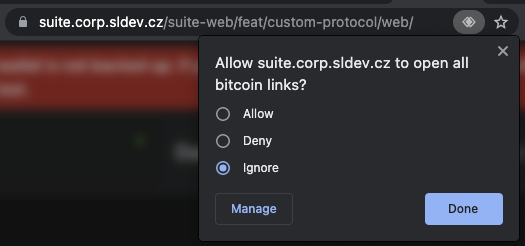
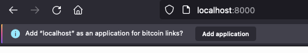
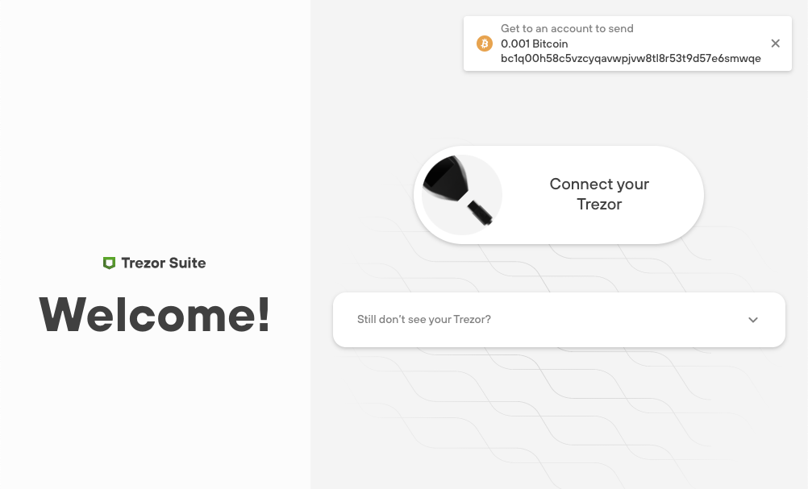
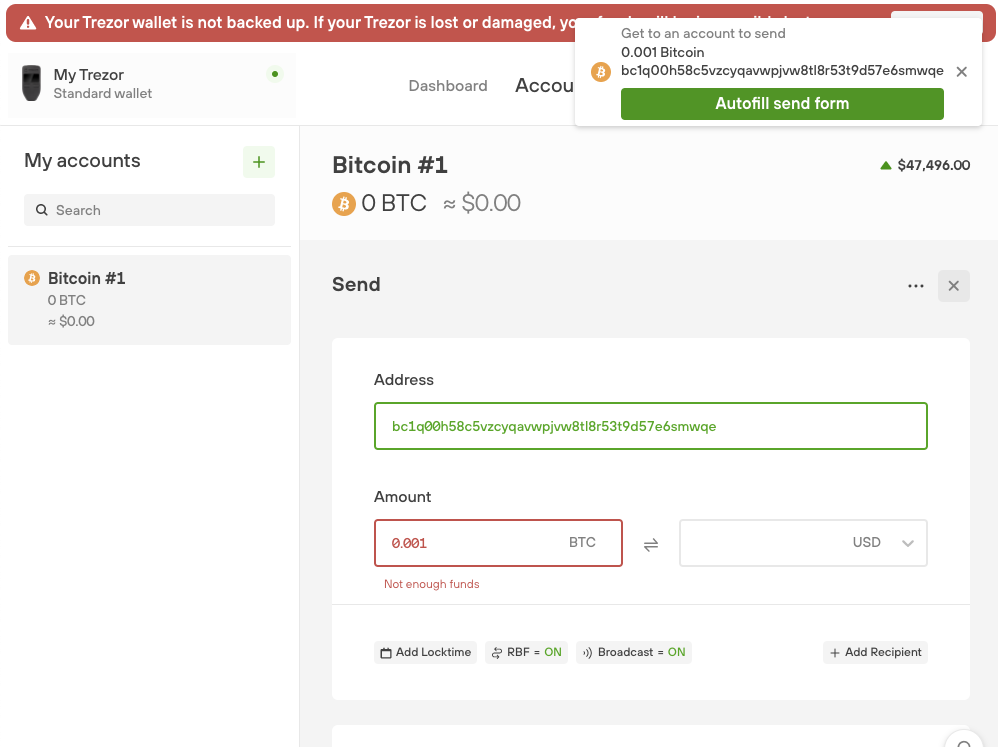

# Coin Protocol Handler
Trezor Suite, both on web and desktop, can handle opening of coin URLs in `coin:address?amount=` format. Currently only `bitcoin:` scheme is supported, but for example `litecoin:` can be easily added.

## Behavior

### Behavior on web
When opening Suite on web, in Firefox it will prompt the user to associate the opening of `bitcoin:` URLs with Suite. On Chrome, you have to click on small icon in address bar and allow `bitcoin:` URLs. By accepting, all `bitcoin:` URLs in the browser will open Suite. 

### Behavior on desktop
By installing the desktop application, the `bitcoin:` protocol handler will be automatically registered in the system. In Firefox, the user will have the choice to use Suite Desktop to open `bitcoin:` URLs or browser if the protocol handler is also registered there. In Chrome, if the desktop application protocol handler is registered but web is not, Chrome will offer the desktop app. If both desktop and web app is registered, Chrome will open the web app without asking.

### More apps with same handler (macOS)

If user has more desktop apps with same handler installed, the behavior is not defined. However, it looks like that the last installed application is launched.

## Structure
The implementation adheres to the [BIP29](https://github.com/bitcoin/bips/blob/master/bip-0021.mediawiki) specification (with the exception of the `label` and `message` parameters).

## Example
[bitcoin:bc1q00h58c5vzcyqavwpjvw8tl8r53t9d57e6smwqe?amount=0.001](bitcoin:bc1q00h58c5vzcyqavwpjvw8tl8r53t9d57e6smwqe?amount=0.001)

## UI

When an app is opened using `bitcoin:` protocol handler, it shows a notification informing a user about stored address and an amount ready to be filled into bitcoin send form.

## Useful links

[Figma](https://www.figma.com/file/hZ22ckyTRlCYRLTNUbTdWO/Exploring-Accounts?node-id=147%3A2605)

[Notion](https://www.notion.so/satoshilabs/BTC-URL-handler-Choose-which-account-from-83d109699a6b45bd98bc4f2fcda73736)

[GitHub](https://github.com/trezor/trezor-suite/issues/3294)

## Handlers manipulation

### Chrome

Navigate to `chrome://settings/handlers` and remove handlers you want.

### Firefox

Navigate to `about:preferences#general` and scroll to `Applications`. Find handler, click on chevron in `Action` column, hit `Application details` and remove apps you want.

### Desktop app - macOS

Delete desktop app and use terminal `open -a Xcode ~/Library/Preferences/com.apple.LaunchServices/com.apple.launchservices.secure.plist`. Find and delete `bitcoin` handler. If it still wants to open a desktop app. Find all occurrences of `Trezor Suite.app` and delete them, even the `.dmg` files in `suite-desktop/build-electron`.