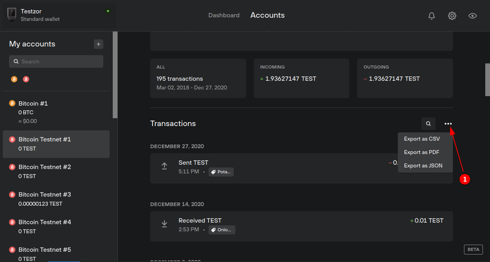

# Transactions - Export

You have the possibility to export your data in multiple formats: PDF, CSV and JSON. The export menu is available by clicking the three little dots near to the search button.

The JSON format contains the most extensive amount of information. This export can be used for data vizualisation for example.
