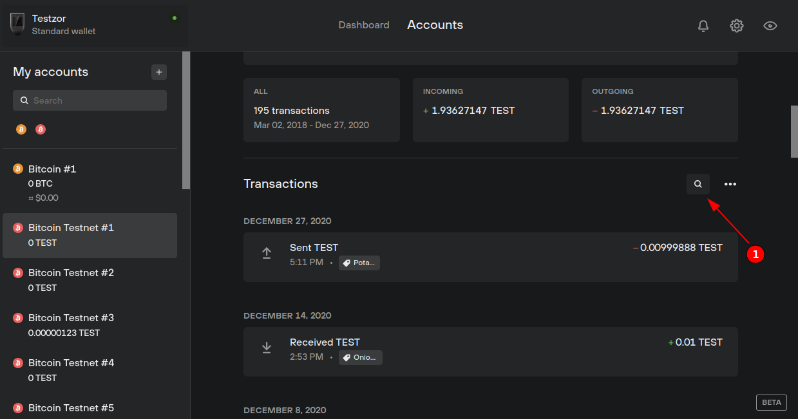

# Transactions - Search

Transactions can be searched using an input field located above the transaction list. Clicking the magnifying glass will open the input and focus in it. You can use the keyboard shortcut `CTRL/⌘ + F` for the same result.

You can search for the following information:

-   Transaction ID (txid)
-   Input and Output addresses
-   Output labels
-   Address labels
-   Amounts
-   Dates

All searches, apart from the two last ones (Amounts and Dates), are free text searches. No specific format is required, anything (txid, addresses, labels) matching the search will be returned.

Any numbers will be treated as amounts. For a given number, partially matching amounts will be shown. Operators, prefixed to the number, can be used for different results:

-   `>` will return amounts greater than the value (i.e. `> 0.001` for all amounts greater than 0.001).
-   `<` will return amounts lower than the value (i.e. `< 0` for all negative amounts).
-   `=` will return amounts that strictly match the value (i.e. `= 0.01` will return all amounts that are exactly 0.01).
-   `!=` will return amounts that do not match the value (i.e. `!= 0.01` will return all amounts that are not 0.01).

Dates provided in the format `yyyy-mm-dd` will return transactions matching that date. Just like amount searches, prefixed operators can be used:

-   `>` will return all transactions after the date, including the given date itself (i.e. `> 2020-12-14` will return all transactions after December 14th, 2020).
-   `<` will return all transactions before the date, including the given date itself (i.e. `< 2020-12-14` will return all transactions before December 14th, 2020).
-   `!=` will return all transactions that are not matching the date (i.e. `!= 2020-12-14` will return all transactions except the ones on December 14th, 2020).

Multiple fields can be searched at the same time using AND (`&`) and OR (`|`) operators. A few examples using these operators might be pretty self-explanatory:

-   `> 2020-12-01 & < 2020-12-31` will return all transactions from December 2020.
-   `> 2020-12-01 & < 2020-12-31 & > 0` will return all incoming (positive) transactions from December 2020.
-   `> 0.01 | > 2020-12-01` will return all transactions with an amount higher than 0.01 OR that have happened since December 1st, 2020.
-   `> 2019-12-01 & < 2019-12-31 | > 2020-12-01 & < 2020-12-31` will return all transactions from December 2020 and 2019.

As you may see in the last example, and similarly to SQL, the AND (`&`) operator has precedence over the OR (`|`) operator.
