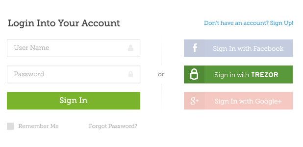
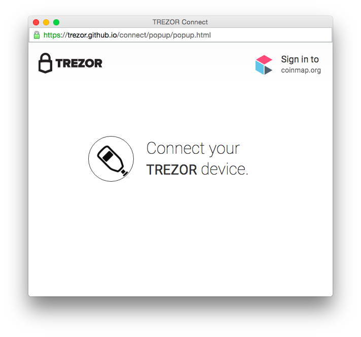
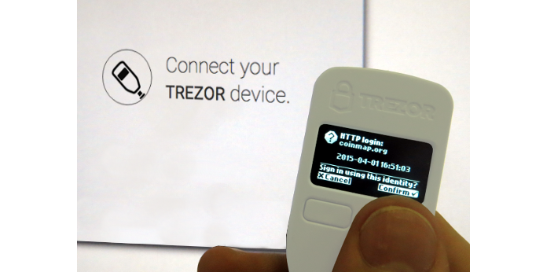

# Login with Trezor

Trezor Connect enables an easy integration of Login with Trezor into websites or applications. It allows a password-less login immune to keyloggers or phishing that provides a simple fluid interface for users with basic computer skills.

**Note** See [requestLogin method](./methods/requestLogin.md) for technical documentation.

## How it works

After you implement Trezor Connect into your web page, the following button will appear:

**Note** It is possible to customize the button to fit your needs and preferences.

When the user clicks the button, the following dialog windows will popup:

and Trezor will show the following confirmation screen:

After the user confirms the action, the device will return a structure with signed login information. Your backend service just needs to check the signature against the user's public key.

## Implementation and security considerations

Trezor Connect leverages the ability of Trezor device to hold securely secret keys and use them to sign messages without actually ever exposing these secrets. Thus when using login with Trezor, no user password is needed and no reusable secret can ever be captured by keylogger or other malware.

There are the following basic scenarios:

-   Sign in with Trezor only (use case A)

This is the most secure option: When the user signs in with Trezor for the first time, the site offers them to create new account with their site-specific Trezor identity.

There is no other way to log in and the site operator should decide carefully if they allow any other (usually much weaker) form of authentication and Trezor identity override.

-   Classic sign in along with Trezor option (use case B)

This case occurs when Trezor is only one of more ways of accessing the user account. Usually, theuser already has an account with username-password authentication and they pair Trezor with the account later.

With this option, the user doesn't have to expose their original credentials each time they authenticate. Nevertheless, they can still easily recover access to the account using username and password if their Trezor identity gets lost.

The site can also give the user an option of disabling the original credentials, thus effectively creating the first use case.

Pairing Trezor with the user's account creates a new way of accessing it. The site should always authenticate the user before confirming the action.

### Trezor identity recovery

Users are instructed to keep their recovery seed safe and offline. Thus in the event of lost device, the user will still be able to log in with Trezor after they recover the seed on a new device. They may also use recovery and login through software, although the login through software means is not supported by Trezor Connect at the moment.

Nevertheless, there will also be rare cases of users who will loose both device and recovery seed. Therefore the site operator could carefully consider reasonable and solid ways of Trezor identity override to enable the user to access their account even without their Trezor.
