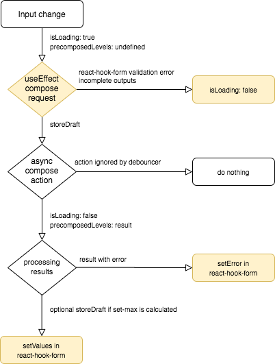
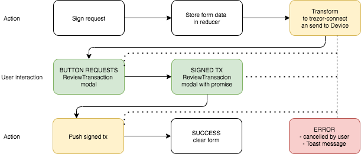

# Send component architecture

Send component is a mix of hooks and redux.

Hooks are used to control and validate form fields using `react-hook-form` library

Redux is used for persistent data like drafts, fiatRates, settings etc...

## @wallet-views/send

Entry point of send form component.
Implements `useSendForm` hook by passing Redux props to it.

## @wallet-hooks/useSendForm

Hook and set of sub-hooks
The whole logic of send form pre/post validation, working with field (recalculation), async transaction composing and sending

## @wallet-actions/sendFormActions

Called from `useSendForm` hook. A set of operations with `@trezor/connect` and post validation (see: [Transaction signing](#L42))

## @wallet-reducers/sendFormReducer

Storing transaction drafts and temporary data used in TransactionReviewModal

# Transaction compose process

Validation of `react-hook-form` state occurs in `React.useEffect` so potential errors are available after render tick.

In order to work with properly validated state `useSendFormCompose.composeRequest` also needs to be handled in `React.useEffect` after render tick.

Every `networkType` has own `sendFormActions.composeTransaction` method

-   `sendFormActionsBitcoin` does calculation using `@trezor/connect`
-   `sendFormActionsEthereum` does calculation locally, custom `feePerUnit` is calculated if `ethereumData` is used
-   `sendFormActionsRipple` does calculation locally, additional `account.reserve` check on recipient address

-   `PrecomposedLevel` are calculated for all possible `FeeLevel` at once.
-   if `FeeLevel` wasn't changed by the user and current `PrecomposedLevel` has error then tries to switch to a lower/custom possible `FeeLevel`
-   if `PrecomposedLevel` has error set this error in `react-hook-form`
-   if `PrecomposedLevel` has `set-max` set calculated amount in `react-hook-form`

# Transaction signing process

Every `networkType` has own `sendFormActions.signTransaction` method. This process is async may be interrupted by the user (ReviewTransaction cancel, disconnect device etc.)

