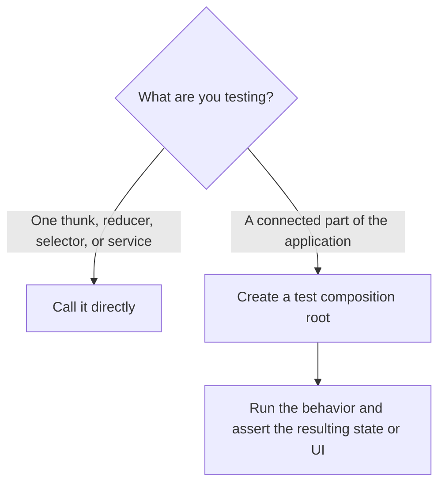

# @suite-common/test-utils

This package provides shared test utilities for Suite. It also re-exports
`@testing-library/react`, so tests can use it as a drop-in replacement.

Most unit tests should not create a Redux store or an application root. Create those only when the
test intentionally covers the integration between business logic, Redux, and injected services.

## Choose the test boundary first



Use a unit test when the subject can receive all its dependencies as arguments. This is the default
for business logic.

Use an integration test when you intentionally want to run a connected part of the application and
verify what its actions, reducers, middleware, and services produce together. For example, dispatch
a user flow and assert the state that ends up in Redux.

## Unit-test business logic directly

Do not create a store merely to obtain `dispatch`, `getState`, or `extra`. A thunk is still a
function, so call that function with those three dependencies directly:

```ts
import { createMockDispatch } from '@suite-common/redux-utils/mocks';

const state: XyzThunkState = {
    // Only the state required by xyzThunk.
};
const extra: XyzThunkDeps = {
    services: {
        // Only the services required by xyzThunk.
    },
};
const getState = () => state;
const { actions, dispatch } = createMockDispatch({ getState, extra });

await xyzThunk()(dispatch, getState, extra);

expect(extra.services.someService).toHaveBeenCalled();
expect(actions).toEqual([
    expect.objectContaining({ type: xyzThunk.pending.type }),
    expect.objectContaining({ type: xyzThunk.fulfilled.type }),
]);
```

`createMockDispatch` is not a Redux store. It is a small function that records plain actions and
runs nested thunks recursively with the same `dispatch`, `getState`, and `extra`. This keeps the test
focused on the thunk contract without constructing unrelated application infrastructure.

Use the same principle for other business logic:

- Call reducers with the previous state and an action.
- Call selectors with the smallest state they declare.
- Create services with explicit mocked dependencies and call the service directly.
- Render hooks without application providers when the hook does not depend on them.

## Integration-test with `createTestCompositionRoot`

Use `createTestCompositionRoot` when Redux integration is part of what the test should prove. It
composes the test the same way an application composition root does: it creates the store, composes
the services from it, and injects them. Thunks read their `extra` lazily, so the services are in
place before anything is dispatched. The store belongs to the services; access it through
`root.services.store`.

Every root declares the application contract it tests. The first type argument is the thunk
dependency contract (`void` when nothing is injected), the second is the state shape. They
type-check the composed services, the reducer and every dispatched thunk. Declare the state as an
explicit type, such as an exported root-state type, instead of deriving it from the reducer with
`ReturnType<typeof reducer>`: the contract then states what the tested code expects, and the reducer
is checked against it. Pass static (non-service) extra dependencies such as `thunks` or `actions` as
`extra`.

```ts
import { createTestCompositionRoot } from '@suite-common/test-utils';

const { services } = createTestCompositionRoot<CounterThunkDeps, CounterRootState>({
    reducer: {
        counter: counterReducer,
    },
    preloadedState: {
        counter: { value: 0 },
    },
    services: () => ({ analytics: mockAnalytics() }),
});

services.store.dispatch(incrementCounter());

expect(services.store.getState().counter.value).toBe(1);
expect(services.store.getActions()).toContainEqual(incrementCounter());
```

Declare only the services and state needed by the tested application slice. The test store also
exposes `getActions` and `clearActions` when action-level assertions are useful.

When a tested service needs the store, compose it from the store passed to `services`:

```ts
const { services } = createTestCompositionRoot<SomeServiceDeps, State>({
    reducer,
    preloadedState,
    services: store => ({
        analytics: mockAnalytics(),
        someService: createSomeService({ dispatch: store.dispatch, getState: store.getState }),
    }),
});
```

`root.extra` is the exact `extra` the thunks receive (`{ ...extra, services }`).

The important difference from a thunk unit test is the assertion target: an integration test runs
the Redux wiring and normally verifies the resulting state or rendered UI, not only whether one
isolated function called another function.

## Testing hooks

Use `renderHook` for a hook that does not depend on application providers:

```ts
import { renderHook } from '@suite-common/test-utils';

const { result } = renderHook(() => useStandaloneHook());
```

A hook that reads Redux state or injected services is an integration test. Create the test
composition root and pass its services to `renderHookWithStoreProvider`:

```ts
import { createTestCompositionRoot, renderHookWithStoreProvider } from '@suite-common/test-utils';

const { services } = createTestCompositionRoot<CounterDeps, CounterRootState>({
    reducer: { counter: counterReducer },
    preloadedState: { counter: { value: 0 } },
    services: () => ({ analytics: mockAnalytics() }),
});

const { result } = renderHookWithStoreProvider(() => useCounter(), { services });
```

The provider supplies Redux from `services.store` and the injected services from `services`.

## Building preloaded state

`initPreloadedState` merges a partial state into the initial state returned by a reducer. Use it when
an integration test needs a complete preloaded state but should override only the relevant fields:

```ts
import { initPreloadedState } from '@suite-common/test-utils';

const preloadedState = initPreloadedState({
    rootReducer,
    partialState: {
        counter: { value: 10 },
    },
});
```

Pass the result to `createTestCompositionRoot`.
