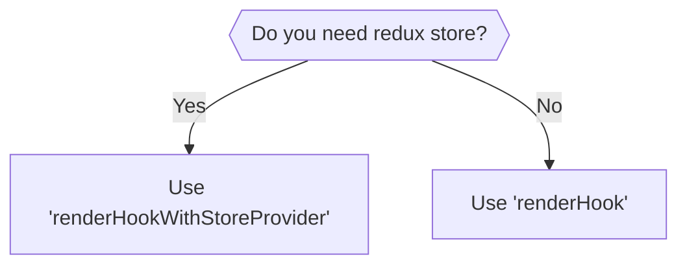

# @suite-common/test-utils

This package provides common utilities for testing React hooks that depend on Redux store.
It also re-exports everything from `@testing-library/react`, so you should use it as a drop-in replacement.

## configureMockStore

`configureMockStore` is a utility for creating a Redux store configured for testing. It wraps `@reduxjs/toolkit`'s `configureStore` with additional testing features like action logging.

### Usage example

```ts
import { configureMockStore } from '@suite-common/test-utils';

const store = configureMockStore({
    reducer: {
        counter: (state = { value: 0 }, action) => {
            if (action.type === 'counter/increment') {
                return { value: state.value + 1 };
            }

            return state;
        },
    },
    preloadedState: {
        counter: { value: 5 },
    },
});

// Dispatch actions
store.dispatch({ type: 'counter/increment' });

// Get current state
expect(store.getState().counter.value).toBe(6);

// Get all dispatched actions
expect(store.getActions()).toEqual([{ type: 'counter/increment' }]);

// Clear action log
store.clearActions();
```

### Configuration options

- `reducer` - Redux reducer or reducer map
- `preloadedState` - Initial state for the store
- `middleware` - Additional middleware to include
- `extra` - Extra dependencies for thunk middleware
- `serializableCheck` - Configuration for serializable check middleware

## initPreloadedState

`initPreloadedState` is a utility for merging partial state with the initial state from a reducer. This is useful when you want to override only specific parts of the state while keeping the rest at their default values.

### Usage example

```ts
import { configureMockStore, initPreloadedState } from '@suite-common/test-utils';

const rootReducer = (state = { counter: { value: 0 }, user: { name: 'John' } }, action) => {
    // reducer logic
    return state;
};

const preloadedState = initPreloadedState({
    rootReducer,
    partialState: {
        counter: { value: 10 },
        // user.name will remain 'John' from default state
    },
});

const store = configureMockStore({
    reducer: rootReducer,
    preloadedState,
});

expect(store.getState()).toEqual({
    counter: { value: 10 },
    user: { name: 'John' },
});
```

## Testing hooks



### Using renderHook

`renderHook` function is just re-exported from `@testing-library/react`. For more information, please refer to
the [official documentation](https://testing-library.com/docs/react-testing-library/intro/).

You should use it when your hook does not depend on any context providers.

### Using renderHookWithStoreProvider

`renderHookWithStoreProvider` is a custom utility that wraps your hook with Redux `Provider`.
Use this when your hook depends on Redux store.

**Note:** Unlike `@suite-native/test-utils`, this utility requires you to provide your own store instance.
There is no `preloadedState` option - you must create and configure the store yourself.

#### Usage example

```ts
import {
    type TestStore,
    act,
    renderHookWithStoreProvider,
    configureMockStore,
} from '@suite-common/test-utils';

describe('useCounter', () => {
    const createStore = (initialValue: number) =>
        configureMockStore({
            reducer: {
                counter: (state = { value: initialValue }, action) => {
                    if (action.type === 'counter/increment') {
                        return { value: state.value + 1 };
                    }

                    return state;
                },
            },
        });

    const renderUseCounter = (store: TestStore) =>
        renderHookWithStoreProvider(() => useCounter(), { store });

    it('should initialize with count from store', () => {
        const store = createStore(5);
        const { result } = renderUseCounter(store);

        expect(result.current.count).toBe(5);
    });

    it('should increment count and update store', () => {
        const store = createStore(0);
        const { result } = renderUseCounter(store);

        act(() => {
            result.current.increment();
        });

        expect(result.current.count).toBe(1);
        expect(store.getState().counter.value).toBe(1);
    });
});
```

#### Injecting custom providers

To inject a custom provider, you can use the `wrapper` option. The custom wrapper will be rendered inside
the Redux `Provider`.

```tsx
import { type TestStore, renderHookWithStoreProvider } from '@suite-common/test-utils';

const renderUseCounterA = (store: TestStore) =>
    renderHookWithStoreProvider(() => useCounter(), { store, wrapper: MyCustomProvider });

const renderUseCounterB = (store: TestStore) =>
    renderHookWithStoreProvider(() => useCounter(), {
        store,
        wrapper: ({ children }) => (
            <MyCustomProvider someProp={someValue}>{children}</MyCustomProvider>
        ),
    });
```
