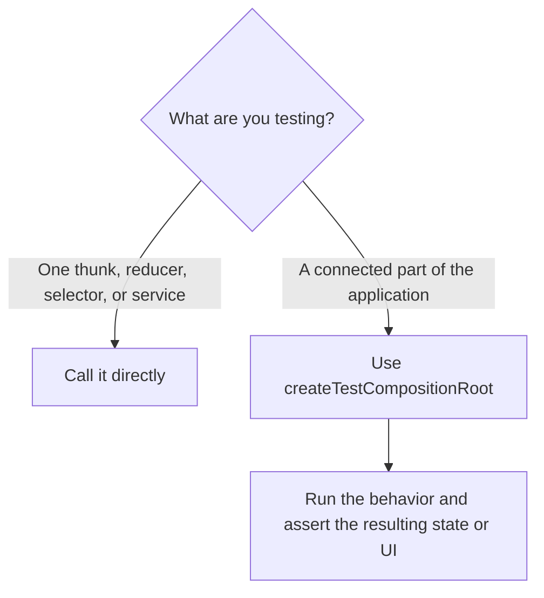

# @suite-common/test-utils

This package provides shared test utilities for Suite. It also re-exports
`@testing-library/react`, so tests can use it as a drop-in replacement.

Most unit tests should not create a Redux store or an application root. Create those only when the
test intentionally covers the integration between business logic, Redux, and injected services.

## Choose the test boundary first



Use a unit test when the subject can receive all its dependencies as arguments. This is the default
for business logic.

Use an integration test when you intentionally want to run a connected part of the application and
verify what its actions, reducers, middleware, and services produce together. For example, dispatch
a user flow and assert the state that ends up in Redux.

## Unit-test business logic directly

Do not create a store merely to obtain `dispatch`, `getState`, or `extra`. A thunk is still a
function, so call that function with those three dependencies directly:

```ts
import { createMockDispatch } from '@suite-common/redux-utils/mocks';

const state: XyzThunkState = {
    // Only the state required by xyzThunk.
};
const extra: XyzThunkDeps = {
    services: {
        // Only the services required by xyzThunk.
    },
};
const getState = () => state;
const { actions, dispatch } = createMockDispatch({ getState, extra });

await xyzThunk()(dispatch, getState, extra);

expect(extra.services.someService).toHaveBeenCalled();
expect(actions).toEqual([
    expect.objectContaining({ type: xyzThunk.pending.type }),
    expect.objectContaining({ type: xyzThunk.fulfilled.type }),
]);
```

`createMockDispatch` is not a Redux store. It is a small function that records plain actions and
runs nested thunks recursively with the same `dispatch`, `getState`, and `extra`. This keeps the test
focused on the thunk contract without constructing unrelated application infrastructure.

Use the same principle for other business logic:

- Call reducers with the previous state and an action.
- Call selectors with the smallest state they declare.
- Create services with explicit mocked dependencies and call the service directly.
- Render hooks without application providers when the hook does not depend on them.

## Integration-test through `createTestCompositionRoot`

Use `createTestCompositionRoot` when Redux integration is part of what the test should prove. It
creates a test application root containing the Redux store and the injected services used by that
store.

```ts
import { createTestCompositionRoot } from '@suite-common/test-utils';

const root = createTestCompositionRoot({
    extra: {
        services: {
            analytics: mockAnalytics(),
        },
    },
    reducer: {
        counter: counterReducer,
    },
    preloadedState: {
        counter: { value: 0 },
    },
});

root.services.dispatch(incrementCounter());

expect(root.store.getState().counter.value).toBe(1);
expect(root.services.getActions()).toContainEqual(incrementCounter());
```

Declare only the services and state needed by the tested application slice. The composition root
also exposes `getActions` and `clearActions` as test services when action-level assertions are
useful.

The important difference from a thunk unit test is the assertion target: an integration test runs
the Redux wiring and normally verifies the resulting state or rendered UI, not only whether one
isolated function called another function.

## Do not call `createTestStore` directly by default

`createTestStore` is the low-level store utility used by `createTestCompositionRoot`. Application
tests should use `createTestCompositionRoot` instead, so the store and its services stay together in
the same shape as an application composition root.

Call `createTestStore` directly only in exceptional low-level tests, such as testing store or
middleware infrastructure where an application service container is deliberately outside the test
boundary. It should not be the normal shortcut for testing thunks, hooks, components, or application
flows.

## Testing hooks

Use `renderHook` for a hook that does not depend on application providers:

```ts
import { renderHook } from '@suite-common/test-utils';

const { result } = renderHook(() => useStandaloneHook());
```

A hook that reads Redux state or injected services is an integration test. Create a test application
root and pass it to `renderHookWithStoreProvider`:

```ts
import { createTestCompositionRoot, renderHookWithStoreProvider } from '@suite-common/test-utils';

const root = createTestCompositionRoot({
    extra: { services: { analytics: mockAnalytics() } },
    reducer: { counter: counterReducer },
    preloadedState: { counter: { value: 0 } },
});

const { result } = renderHookWithStoreProvider(() => useCounter(), { root });
```

The provider supplies both Redux and the injected services from the same test composition root.

## Building preloaded state

`initPreloadedState` merges a partial state into the initial state returned by a reducer. Use it when
an integration test needs a complete preloaded state but should override only the relevant fields:

```ts
import { initPreloadedState } from '@suite-common/test-utils';

const preloadedState = initPreloadedState({
    rootReducer,
    partialState: {
        counter: { value: 10 },
    },
});
```

Pass the result to `createTestCompositionRoot`; do not create a standalone store only to initialize
state.
