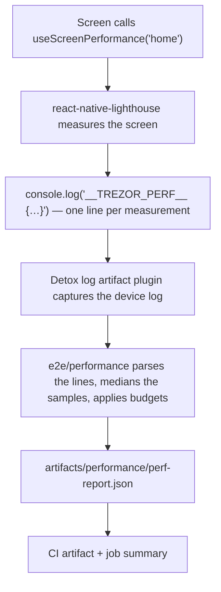

# Suite Native E2E performance metrics

A suite-native Detox run can measure how long an instrumented screen takes to render and to become
usable, and writes the numbers for the whole run into one JSON report next to the run's other
artifacts.

Everything here is **warn-only**. A screen over its threshold is written into the report, printed in
the run log and annotated on the CI run — it never fails a test and never fails the job.

## What is measured

Instrumentation comes from [`react-native-lighthouse`](https://www.npmjs.com/package/react-native-lighthouse),
wrapped by the `@suite-native/performance-metrics` package so a screen only ever sees the wrapper.

| Metric              | Key               | Means                                                                        |
| ------------------- | ----------------- | ---------------------------------------------------------------------------- |
| Time to first frame | `ttffMs`          | Mount until the screen's first frame is on the display.                      |
| Time to interactive | `ttiMs`           | Mount until the screen reports itself ready, i.e. calls `markInteractive()`. |
| First input delay   | `fidMs`           | The delay between the first touch on the screen and the app reacting to it.  |
| Score               | `lighthouseScore` | The library's own 0–100 roll-up of the above.                                |

A metric the library could not produce is `null` — never `0`, and never simply absent. `null` and a
zero are very different statements, and the report keeps them apart everywhere.

## How a number reaches the report



### 1. In the app

A screen calls `useScreenPerformance(screen)` and wires up the two things the library cannot do by
itself:

- **`markInteractive()`** — the screen calls it when its real content is on screen. Without that
  call there is no `ttiMs`; the hook has no way to guess when a list stopped being a spinner.
- **`panHandlers`** — spread onto the screen's root view. Without it there is no `fidMs`, because
  nothing is watching for the first touch.

Instrumentation is gated on `isDetoxTestBuild()` (`suite-native/config/src/environment.ts`, driven by
`EXPO_PUBLIC_IS_DETOX_BUILD`). Outside a Detox build the hook is an inert no-op and the library does
not enter the bundle.

The per-screen how-to — which screens are instrumented, and how to add one — lives in the
`@suite-native/performance-metrics` README, next to the code.

### 2. The app → test channel

Detox's channel into the app is `launchArgs`, and it only goes one way. The way back out is the
device log, which Detox already captures. So a completed measurement is written as exactly one line:

```text
__TREZOR_PERF__ {"screen":"home","ttffMs":123.4,"ttiMs":456.7,"fidMs":12.3,"score":87,"timestamp":1750000000000}
```

The prefix (`PERFORMANCE_LOG_PREFIX`), one space, then one line of JSON and nothing else. The prefix
and the sample type are exported by the package, so neither side re-declares the literal.

### 3. Extraction and aggregation

Detox's `log` artifact plugin (`suite-native/app/.detoxrc.js`) writes the device log into the run's
directory under `suite-native/app/artifacts/`. After the run, the code in
`suite-native/app/e2e/performance/` reads those logs, picks out the prefixed lines, groups the
samples by screen, reduces each screen's samples to a **median per metric**, compares the medians
against that screen's budget, and writes the report to:

```text
suite-native/app/artifacts/performance/perf-report.json
```

`artifacts/` is wiped at the start of every run (`scripts/cleanArtifacts.js`, plus Detox's
`keepPrevious: false`), so the report only ever describes the run that has just finished.

### 4. In CI

`.github/workflows/template-suite-native-e2e-android.yml` does three things with it, all after the
test step and all `if: always()`:

- **Summarize performance report** — renders one table row per screen and metric into the job
  summary, plus the aggregate score. A missing file is a log line, a malformed file is a
  `::warning`; neither is an error, and the step is `continue-on-error` on top of that.
- **Store performance report** — uploads the single JSON as `android-perf-report-<shard>`, with
  `if-no-files-found: ignore` so a shard that measured nothing uploads nothing and stays green.
- **Store test artifacts** — the pre-existing wholesale upload of `suite-native/app/artifacts` as
  `android-tests-<shard>`. The report is inside that bundle too; the separate artifact exists so the
  numbers can be fetched without downloading the run's videos and screenshots.

Each of the five shards produces its own report and its own artifact.

## Thresholds

Budgets live in `suite-native/app/e2e/performance/budgets.ts`, keyed by screen, split the same way as
the desktop `suite/e2e/performance/budgets.ts`:

- **`BASELINES`** — what a screen costs today. Reference only, never enforced.
- **`LIMITS`** — the highest value a metric may reach before it is reported as over limit. A metric
  with no limit cannot go over one, which is why `lighthouseScore` has none: it is better when
  higher, so a ceiling would report it backwards. It is reported next to the timings that do carry
  limits.

Both are checked-in numbers, so moving a limit is a reviewed code change rather than a setting
someone can quietly relax. `BASELINES` starts empty — it is filled from a real run, and the
end-of-run table prints the block to paste in.

A breach sets `exceededLimit` on the metric, `overLimit` on the screen and on `aggregate`, and is
called out in the log and the job summary. Nothing throws. A performance number is not on its own a
reason to block a merge, and a report everyone can see is worth more than a red build everyone
learns to re-run.

## Before trusting a number

- **Debug builds are not representative.** A debug build serves its JS from Metro with dev-mode React
  and no minification. Only release-configuration builds (`android.emu.release`, what CI runs) mean
  anything. The same caveat sank several measurements in the earlier Maestro/Flashlight
  investigation, and it applies unchanged here.
- **Check the bundle is yours.** A release APK ships a compiled bundle. If the APK was not rebuilt
  after a JS change, the run measures the old code and says nothing about the new.
- **Emulator, not phone.** CI measures a headless `Pixel_6_API_34` AVD on a shared GitHub runner:
  software rendering (`-gpu lavapipe`), 4 cores, 4 GB RAM, animations disabled. The absolute numbers
  describe that machine. Compare CI runs to CI runs, and local runs to local runs; never one to the
  other.
- **Cold start is not warm start.** The first screen after a fresh install carries app startup in its
  `ttffMs`; the same screen revisited inside a live session does not. They are two different
  measurements and pooling them produces a median of neither. The Maestro work had to measure a
  scenario and its warm reload as two separate runs for exactly this reason.
- **A median of one is a single run.** Each screen carries its own `sampleCount` (`meta.sampleCount`
  is the run's total), and the job summary prints it per row. A screen a flow visits once has no
  noise rejection at all; a screen it revisits does.
- **`fidMs` needs a real touch in time.** FID is only recorded if a tap lands within the hook's
  `fidTimeout` (5 s by default). Detox taps are synthetic and scripted, so a screen the test does not
  touch — or touches late — reports `fidMs: null`. That is an honest "not measured", not a fast app.
- **The device environment is in the measurement.** For screens that talk to a device, trezor-user-env
  and the bridge sit inside the timing. The Maestro investigation repeatedly hit duplicate bridges
  fighting over port `21328`, which shows up as stalled discovery and an enormous `ttiMs` rather than
  as an obviously broken run. Read the trezor-user-env logs in the same artifact bundle before
  believing a regression.
- **Do not add across shards.** The five shards split by test file, so a given screen is usually
  measured on one shard only and each shard reports independently.

## Compared to the desktop report

The desktop pipeline (`@trezor/perf-e2e`, `suite/e2e/performance/`) reports the same kind of thing for
Playwright runs. The native report deliberately mirrors its row shape so one tool can read both, and
differs only where the platform forces it.

|                 | Desktop (`@trezor/perf-e2e`)                                                                                                     | Native (this feature)                                                                    | Why                                                                                                                                                                                                    |
| --------------- | -------------------------------------------------------------------------------------------------------------------------------- | ---------------------------------------------------------------------------------------- | ------------------------------------------------------------------------------------------------------------------------------------------------------------------------------------------------------ |
| Artifact        | one `perf-report-<scenario>.json` per measured scenario, attached to the Playwright result                                       | one `perf-report.json` per run, at `suite-native/app/artifacts/performance/`             | Detox has no attachment API; the run's artifacts directory is what CI already collects                                                                                                                 |
| Top level       | the scenario object itself (`PerfJsonReport`)                                                                                    | a `{ meta, screens, aggregate }` envelope around scenario objects                        | one file per run needs to say which run it is, and to carry more than one screen                                                                                                                       |
| Scenario row    | `scenario`, `overLimit`, `unlimited`, `metrics[]`                                                                                | the same four fields, per entry of `screens[]`                                           | field-for-field on purpose                                                                                                                                                                             |
| Metric row      | `key`, `label`, `unit`, `baseline`, `current`, `limit`, `ratioToLimit`, `exceededLimit`                                          | identical                                                                                | field-for-field on purpose                                                                                                                                                                             |
| Metric keys     | `totalBlockingTimeMs`, `longTaskCount`, `longestTaskMs`, `reactCommitCount`, `interactionDurationMs` (the `PerfMetricKey` union) | `ttffMs`, `ttiMs`, `fidMs`, `lighthouseScore`                                            | main-thread work in a browser vs. a React Native screen's lifecycle — the two sets do not overlap, so `PerfMetricKey` is **not** widened to hold both; desktop shares that type and it stays desktop's |
| A row measures  | one interaction, instrumented in the page                                                                                        | one screen, from mount to interactive, instrumented in the component                     |                                                                                                                                                                                                        |
| Aggregation     | the Playwright reporter medians the retries of one test × project in memory at end of run                                        | the e2e side medians all samples of a screen while writing the file                      | Detox has no reporter plugin to aggregate in, so the median is baked into the artifact                                                                                                                 |
| Sample count    | implicit in the retries, printed to the log                                                                                      | explicit, `meta.sampleCount`                                                             | a consumer of the file cannot count runs it never saw                                                                                                                                                  |
| Run identity    | measurement key `scenario [MODEL]`, plus a synthetic URL per measurement                                                         | `meta.platform`, `meta.device`, `meta.appVersion`, `meta.commitHash`, `meta.generatedAt` |                                                                                                                                                                                                        |
| Budgets         | `suite/e2e/performance/budgets.ts`, keyed `scenario [MODEL]`                                                                     | `suite-native/app/e2e/performance/budgets.ts`, keyed by screen                           | same `BASELINES` / `LIMITS` split; the native keys carry no device-model dimension                                                                                                                     |
| Overall verdict | none in the JSON; the reporter computes it                                                                                       | `aggregate: { score, overLimit }`                                                        | the native metrics roll up into a single 0–100 score, the desktop ones have no such scalar                                                                                                             |
| On a breach     | reported, never thrown                                                                                                           | reported, never thrown                                                                   |                                                                                                                                                                                                        |

Two consequences of the last budget row are worth knowing. The Android release runner drives several
device-model projects (`T3W1`, `T3T1`, `T1B1`, `no_device`) inside one job, and the native report
keys screens by screen name alone — so if one screen is measured under more than one project, those
samples land in the same median. And because `meta` has no model field, a report cannot be split back
apart afterwards. Both are fine while the instrumented screens are model-independent, and both are
the first thing to fix if that stops being true.

## Where things live

| Path                                                      | What                                                                                       |
| --------------------------------------------------------- | ------------------------------------------------------------------------------------------ |
| `suite-native/performance-metrics/`                       | the `@suite-native/performance-metrics` package: the hook, the log prefix, the sample type |
| `suite-native/app/e2e/performance/`                       | log parsing, median, budget comparison, report writing                                     |
| `suite-native/app/e2e/performance/budgets.ts`             | the checked-in thresholds                                                                  |
| `suite-native/app/artifacts/performance/perf-report.json` | the report a run produces                                                                  |
| `.github/workflows/template-suite-native-e2e-android.yml` | the job summary and the `android-perf-report-<shard>` upload                               |
| `packages/perf-e2e/`, `suite/e2e/performance/`            | the desktop counterpart the format mirrors                                                 |
