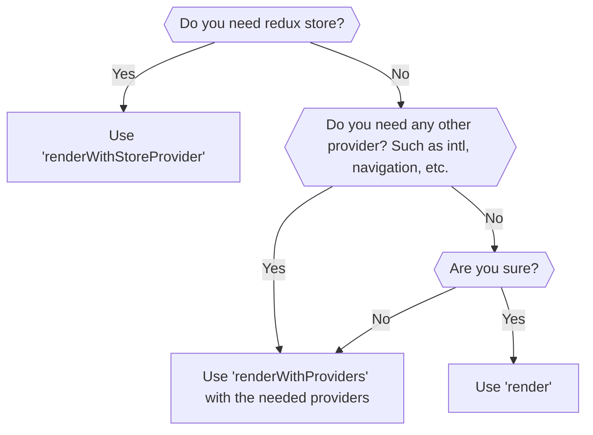
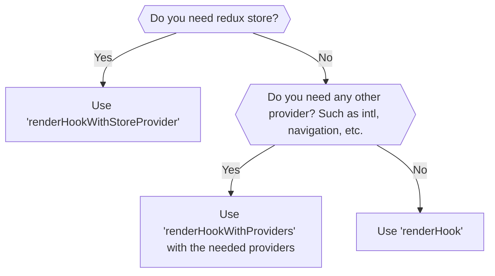

# @suite-native/test-utils

This package is wrapper around `@testing-library/react-native` that provides some custom utilities for testing React
Native components in the Suite Native project.
It also reexports everything from `@testing-library/react-native`, so you should use it as a drop-in replacement.

## Testing components



### Using render

`render` function is just re-exported from `@testing-library/react-native`. For more information, please refer to
the [official documentation](https://testing-library.com/docs/react-native-testing-library/intro/).

You most probably do not want to use this function directly.

### Using renderWithProviders

`renderWithProviders` is a custom utility that wraps the element in a composable provider stack. Two providers are
always on:

- **SafeAreaProvider**
- **StylesProvider**: With `colorVariant` set to `standard`.

The rest are opt-in via the `providers` option (`ProviderKey[]`):

- `'intl'` — **IntlProvider** simplified for tests. Always uses `en-US` locale.
- `'navigation'` — **NavigationContainer** from `@react-navigation/native`.
- `'services'` — **NativeServicesProvider** with `extraDependenciesNativeMock.services`.
- `'formatter'` — **FormatterProvider** with `locale: 'en'` and `baseCurrency: 'usd'` (override via `formattersConfig`).
- `'bottomSheet'` — **BottomSheetModalProvider**.

Pick the smallest list that makes the component under test render. Leaving providers out keeps the test fast, because
each opt-in provider pulls in its module graph at import time.

If you need the full stack, import `ALL_PROVIDERS` and pass it as the `providers` option.

#### Usage example

Basic usage

```tsx
import { renderWithProviders, userEvent } from '@suite-native/test-utils';

describe('Counter', () => {
    it('should start with 0 value', () => {
        const { getByLabelText } = renderWithProviders(<Counter />, { providers: ['intl'] });

        expect(getByLabelText('Counter value')).toHaveTextContent('0');
    });

    it('should increment value on button press', async () => {
        const { getByLabelText, getByText } = renderWithProviders(<Counter />, {
            providers: ['intl'],
        });

        await userEvent.press(getByText('+'));

        expect(getByLabelText('Counter value')).toHaveTextContent('1');
    });
});
```

### Using renderWithStoreProvider

`renderWithStoreProvider` is a custom utility that provides all the context providers from `renderWithProviders` (with
the full `ALL_PROVIDERS` stack) plus:

- **Redux store provider**
- Formatters config is now loaded from store instead of being hardcoded.
- Allows to specify custom store or preloaded state.

#### Usage with preloaded state

Use when you do not need to access the store directly, but you want to set some initial state for your component.
For example, you want to test how your component renders with some specific value from the store.

```tsx
import {
    type PreloadedState,
    initStore,
    renderWithStoreProvider,
    userEvent,
} from '@suite-native/test-utils';

describe('Counter', () => {
    const renderCounter = (preloadedState: PreloadedState) =>
        renderWithStoreProvider(<Counter />, { preloadedState });

    it('should render correct value on 1st render', () => {
        const preloadedState: PreloadedState = {
            counter: { value: 1 },
        };
        const { getByLabelText } = renderCounter(preloadedState);

        expect(getByLabelText('Counter value')).toHaveTextContent('1');
    });

    it('should increment value on button press', async () => {
        const preloadedState: PreloadedState = {
            counter: { value: 1 },
        };
        const { getByLabelText, getByText } = renderCounter(preloadedState);

        await userEvent.press(getByText('+'));

        expect(getByLabelText('Counter value')).toHaveTextContent('2');
    });
});
```

#### Usage with custom store

Use when you need to access the store directly in your test.
For example, you want to check if some action was dispatched or if the state was updated correctly.
You have also possibility to dispatch an action by yourself.

```tsx
import {
    type TestStore,
    act,
    initStore,
    renderWithStoreProvider,
    userEvent,
} from '@suite-native/test-utils';

describe('Counter', () => {
    let store: TestStore;

    beforeEach(() => {
        ({ store } = initStore({ counter: { value: 0 } }));
    });

    const renderCounter = () => renderWithStoreProvider(<Counter />, { store });

    it('should react to state changes', () => {
        const { getByLabelText } = renderCounter();

        act(() => {
            store.dispatch({ type: 'counter/increment' });
        });

        expect(getByLabelText('Counter value')).toHaveTextContent('1');
    });

    it('should increment value on button press', async () => {
        const { getByLabelText, getByText } = renderCounter();

        await userEvent.press(getByText('+'));

        expect(getByLabelText('Counter value')).toHaveTextContent('1');
        expect(store.getState().counter.value).toBe(1);
        expect(store.getActions()).toContainEqual({ type: 'counter/increment' });
    });
});
```

#### Injecting custom providers

To inject custom provider, you can use `wrapper` option of either `render`, `renderWithProviders` or
`renderWithStoreProvider`.

```tsx
const renderCounterA = () =>
    renderWithStoreProvider(<Counter />, { store, wrapper: MyCustomProvider });

const renderCounterB = () =>
    renderWithProviders(<Counter />, {
        providers: ['intl'],
        wrapper: ({ children }) => (
            <MyCustomProvider someProp={someValue}>{children}</MyCustomProvider>
        ),
    });
```

## Testing hooks



### Using renderHook

`renderHook` function is just re-exported from `@testing-library/react-native`. For more information, please refer to
the [official documentation](https://testing-library.com/docs/react-native-testing-library/intro/).

You should use it when your hook does not depend on any context providers.

### Using renderHookWithProviders

`renderHookWithProviders` is a custom utility that provides the same composable provider stack as `renderWithProviders`.
For more information, please refer to the section about `renderWithProviders`.

#### Usage example

```ts
import { act, renderHookWithProviders } from '@suite-native/test-utils';

describe('useCounter', () => {
    const renderUseCounter = () =>
        renderHookWithProviders(() => useCounter(), { providers: ['intl'] });

    it('should initialize with count 0', () => {
        const { result } = renderUseCounter();

        expect(result.current.count).toBe(0);
    });

    describe('increment', () => {
        it('should increment count by 1', () => {
            const { result } = renderUseCounter();

            act(() => {
                result.current.increment();
            });

            expect(result.current.count).toBe(1);
        });
    });
});
```

### Using renderHookWithStoreProvider

`renderHookWithStoreProvider` is a custom utility that provides the same context providers as `renderWithStoreProvider`.
For more information, please refer to the section about `renderWithStoreProvider`.

#### Usage with preloaded state

```ts
import {
    type PreloadedState,
    act,
    initStore,
    renderHookWithStoreProvider,
} from '@suite-native/test-utils';

describe('useCounter', () => {
    const renderUseCounter = (store: PreloadedState) =>
        renderHookWithStoreProvider(() => useCounter(), { store });

    it('should initialize with count from store', () => {
        const { result } = renderUseCounter({
            counter: { value: 5 },
        });

        expect(result.current.count).toBe(5);
    });
});
```

#### Usage example with store access

```ts
import { act, initStore, renderHookWithStoreProvider } from '@suite-native/test-utils';

describe('useCounter', () => {
    const renderUseCounter = (store: TestStore) =>
        renderHookWithStoreProvider(() => useCounter(), { store });

    it('should increment count and update store', () => {
        const store = initStore({ counter: { value: 0 } });
        const { result } = renderUseCounter(store);

        act(() => {
            result.current.increment();
        });

        expect(result.current.count).toBe(1);
        expect(store.getState().counter.value).toBe(1);
        expect(store.getActions()).toContainEqual({ type: 'counter/increment' });
    });
});
```

#### Injecting custom providers

To inject custom provider, you can use `wrapper` option of either `renderHook`, `renderHookWithProviders` or
`renderHookWithStoreProvider`.

```tsx
const renderUseCounterA = () =>
    renderHookWithStoreProvider(() => useCounter(), { store, wrapper: MyCustomProvider });

const renderUseCounterB = () =>
    renderHookWithProviders(() => useCounter(), {
        providers: ['intl'],
        wrapper: ({ children }) => (
            <MyCustomProvider someProp={someValue}>{children}</MyCustomProvider>
        ),
    });
```
