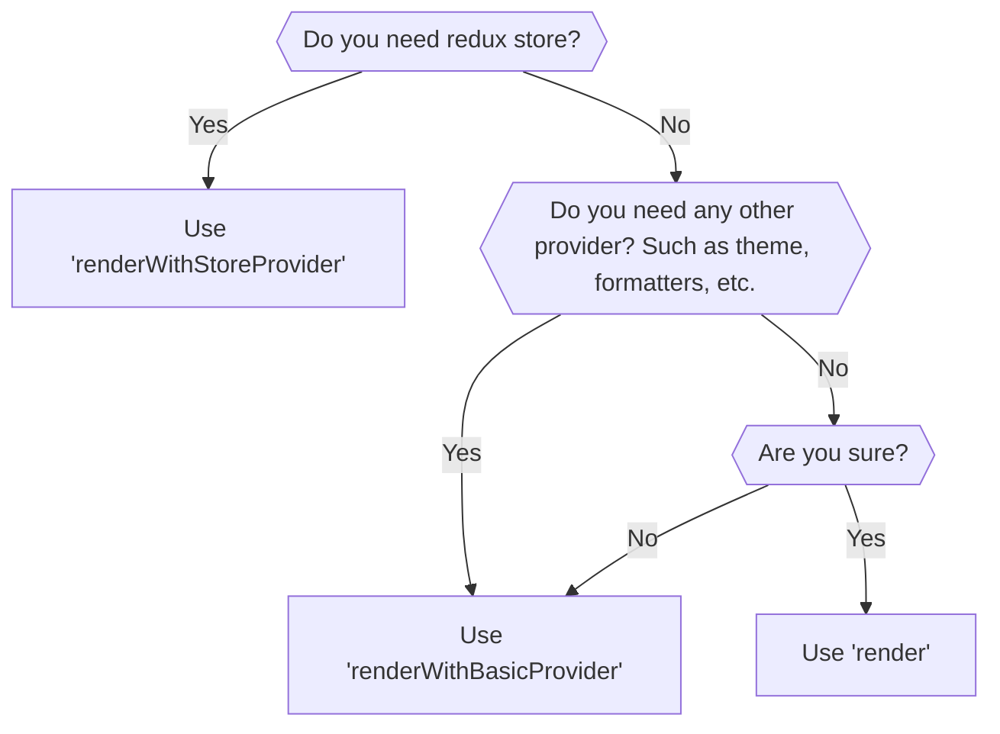
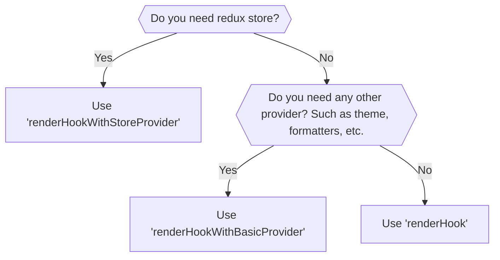

# @suite/test-utils

This package is a wrapper around `@testing-library/react` that provides custom utilities for testing React
components in the Trezor Suite web application.
It also re-exports everything from `@testing-library/react`, so you should use it as a drop-in replacement.

## Testing components



### Using render

`render` function is just re-exported from `@testing-library/react`. For more information, please refer to
the [official documentation](https://testing-library.com/docs/react-testing-library/intro/).

You most probably do not want to use this function directly.

### Using renderWithBasicProvider

`renderWithBasicProvider` is a custom utility that provides basic context providers. Namely:

- **IntlProvider**: For internationalization support. Uses `en` locale by default with empty messages for tests.
- **ConnectedThemeProvider**: For theme support.
- **ResponsiveContextProvider**: For responsive design support.
- **SuiteServicesProvider**: With `extraDependenciesDesktopMock.services`.
- **MockedFormatterProvider**: For currency and number formatting in tests.

#### Usage example

Basic usage

```tsx
import { renderWithBasicProvider, userEvent } from '@suite/test-utils';

describe('Counter', () => {
    it('should start with 0 value', () => {
        const { getByLabelText } = renderWithBasicProvider(<Counter />);

        expect(getByLabelText('Counter value')).toHaveTextContent('0');
    });

    it('should increment value on button press', async () => {
        const { getByLabelText, getByText } = renderWithBasicProvider(<Counter />);
        const user = userEvent.setup();

        await user.click(getByText('+'));

        expect(getByLabelText('Counter value')).toHaveTextContent('1');
    });
});
```

### Using renderWithStoreProvider

`renderWithStoreProvider` is a custom utility that provides all the context providers from `renderWithBasicProvider`
plus:

- **Redux store provider**
- Allows to specify custom store or preloaded state.

#### Usage with preloaded state

Use when you do not need to access the store directly, but you want to set some initial state for your component.
For example, you want to test how your component renders with some specific value from the store.

```tsx
import { type PreloadedState, renderWithStoreProvider, userEvent } from '@suite/test-utils';

describe('Counter', () => {
    const renderCounter = (preloadedState: PreloadedState) =>
        renderWithStoreProvider(<Counter />, { preloadedState });

    it('should render correct value on 1st render', () => {
        const preloadedState: PreloadedState = {
            counter: { value: 1 },
        };
        const { getByLabelText } = renderCounter(preloadedState);

        expect(getByLabelText('Counter value')).toHaveTextContent('1');
    });

    it('should increment value on button press', async () => {
        const preloadedState: PreloadedState = {
            counter: { value: 1 },
        };
        const { getByLabelText, getByText } = renderCounter(preloadedState);
        const user = userEvent.setup();

        await user.click(getByText('+'));

        expect(getByLabelText('Counter value')).toHaveTextContent('2');
    });
});
```

#### Usage with custom store

Use when you need to access the store directly in your test.
For example, you want to check if some action was dispatched or if the state was updated correctly.
You have also the possibility to dispatch an action by yourself.

```tsx
import {
    type TestStore,
    act,
    initStoreForTests,
    renderWithStoreProvider,
    userEvent,
} from '@suite/test-utils';

describe('Counter', () => {
    let store: TestStore;

    beforeEach(() => {
        ({ store } = initStoreForTests({ counter: { value: 0 } }));
    });

    const renderCounter = () => renderWithStoreProvider(<Counter />, { store });

    it('should react to state changes', () => {
        const { getByLabelText } = renderCounter();

        act(() => {
            store.dispatch({ type: 'counter/increment' });
        });

        expect(getByLabelText('Counter value')).toHaveTextContent('1');
    });

    it('should increment value on button press', async () => {
        const { getByLabelText, getByText } = renderCounter();
        const user = userEvent.setup();

        await user.click(getByText('+'));

        expect(getByLabelText('Counter value')).toHaveTextContent('1');
        expect(store.getState().counter.value).toBe(1);
    });
});
```

## Testing hooks



### Using renderHook

`renderHook` function is just re-exported from `@testing-library/react`. For more information, please refer to
the [official documentation](https://testing-library.com/docs/react-testing-library/intro/).

You should use it when your hook does not depend on any context providers.

### Using renderHookWithBasicProvider

`renderHookWithBasicProvider` is a custom utility that provides the same context providers as `renderWithBasicProvider`.
For more information, please refer to the section about `renderWithBasicProvider`.

#### Usage example

```ts
import { act, renderHookWithBasicProvider } from '@suite/test-utils';

describe('useCounter', () => {
    const renderUseCounter = () => renderHookWithBasicProvider(() => useCounter());

    it('should initialize with count 0', () => {
        const { result } = renderUseCounter();

        expect(result.current.count).toBe(0);
    });

    describe('increment', () => {
        it('should increment count by 1', () => {
            const { result } = renderUseCounter();

            act(() => {
                result.current.increment();
            });

            expect(result.current.count).toBe(1);
        });
    });
});
```

### Using renderHookWithStoreProvider

`renderHookWithStoreProvider` is a custom utility that provides the same context providers as `renderWithStoreProvider`.
For more information, please refer to the section about `renderWithStoreProvider`.

#### Usage with preloaded state

```ts
import { type PreloadedState, act, renderHookWithStoreProvider } from '@suite/test-utils';

describe('useCounter', () => {
    const renderUseCounter = (preloadedState: PreloadedState) =>
        renderHookWithStoreProvider(() => useCounter(), { preloadedState });

    it('should initialize with count from store', () => {
        const { result } = renderUseCounter({
            counter: { value: 5 },
        });

        expect(result.current.count).toBe(5);
    });
});
```

#### Usage example with store access

```ts
import {
    type TestStore,
    act,
    initStoreForTests,
    renderHookWithStoreProvider,
} from '@suite/test-utils';

describe('useCounter', () => {
    let store: TestStore;

    beforeEach(() => {
        ({ store } = initStoreForTests({ counter: { value: 0 } }));
    });

    const renderUseCounter = () => renderHookWithStoreProvider(() => useCounter(), { store });

    it('should increment count and update store', () => {
        const { result } = renderUseCounter();

        act(() => {
            result.current.increment();
        });

        expect(result.current.count).toBe(1);
        expect(store.getState().counter.value).toBe(1);
    });
});
```

## Best Practices

### Always use userEvent over fireEvent

`userEvent` provides more realistic user interactions compared to `fireEvent`. It simulates the full user interaction flow:

```tsx
// ❌ Bad - using fireEvent
import { fireEvent, renderWithBasicProvider } from '@suite/test-utils';

fireEvent.click(button);

// ✅ Good - using userEvent
import { renderWithBasicProvider, userEvent } from '@suite/test-utils';

const user = userEvent.setup();
await user.click(button);
```

### Use screen queries for better error messages

Import `screen` from `@suite/test-utils` for better error messages when elements are not found:

```tsx
import { screen, renderWithBasicProvider } from '@suite/test-utils';

renderWithBasicProvider(<MyComponent />);

// ✅ Better error messages
const button = screen.getByRole('button', { name: /submit/i });
```

### Prefer getByRole over other queries

`getByRole` encourages accessible components and provides better error messages:

```tsx
// ✅ Best - semantic and accessible
screen.getByRole('button', { name: /submit/i });

// ⚠️ OK - but less accessible
screen.getByLabelText('Submit');

// ❌ Avoid - implementation details
screen.getByTestId('submit-button');
```

### Wait for async operations

Use `waitFor` when testing asynchronous behavior:

```tsx
import { waitFor, screen, renderWithBasicProvider, userEvent } from '@suite/test-utils';

it('should load data on mount', async () => {
    renderWithBasicProvider(<DataComponent />);
    const user = userEvent.setup();

    await user.click(screen.getByRole('button', { name: /load/i }));

    await waitFor(() => {
        expect(screen.getByText('Data loaded')).toBeInTheDocument();
    });
});
```

## Common Patterns

### Testing Redux-connected components

```tsx
import { renderWithStoreProvider, screen } from '@suite/test-utils';

describe('AccountSelector', () => {
    it('should display account balance', () => {
        const preloadedState = {
            wallet: {
                accounts: [{ id: '1', balance: '1.5', symbol: 'BTC' }],
            },
        };

        renderWithStoreProvider(<AccountSelector />, { preloadedState });

        expect(screen.getByText('1.5 BTC')).toBeInTheDocument();
    });
});
```

### Testing forms

```tsx
import { renderWithBasicProvider, screen, userEvent, waitFor } from '@suite/test-utils';

describe('LoginForm', () => {
    it('should submit form with valid data', async () => {
        const onSubmit = jest.fn();
        const user = userEvent.setup();

        renderWithBasicProvider(<LoginForm onSubmit={onSubmit} />);

        await user.type(screen.getByLabelText(/email/i), 'test@example.com');
        await user.type(screen.getByLabelText(/password/i), 'password123');
        await user.click(screen.getByRole('button', { name: /submit/i }));

        await waitFor(() => {
            expect(onSubmit).toHaveBeenCalledWith({
                email: 'test@example.com',
                password: 'password123',
            });
        });
    });
});
```

### Testing components with internationalization

```tsx
import { renderWithBasicProvider, screen } from '@suite/test-utils';

describe('WelcomeMessage', () => {
    it('should display welcome message', () => {
        renderWithBasicProvider(<WelcomeMessage />);

        // Component should handle translation internally
        expect(screen.getByText(/welcome/i)).toBeInTheDocument();
    });
});
```

## Exported Utilities

The package exports the following utilities:

### Rendering functions

- `render` - Basic render from @testing-library/react
- `renderWithBasicProvider` - Render with basic providers
- `renderWithStoreProvider` - Render with store and basic providers
- `renderHook` - Render hook from @testing-library/react
- `renderHookWithBasicProvider` - Render hook with basic providers
- `renderHookWithStoreProvider` - Render hook with store and basic providers

### Testing utilities

- `screen` - Query methods bound to document.body
- `waitFor` - Wait for async operations
- `act` - Wrap state updates
- `userEvent` - User interaction simulation

### Store utilities

- `initStoreForTests` - Initialize Redux store for tests with history mocked
- `TestStore` (type) - TypeScript type for test store
- `PreloadedState` (type) - TypeScript type for preloaded state

### Provider components

- `BasicProviderForTests` - Basic provider wrapper
- `StoreProviderForTests` - Store provider wrapper
