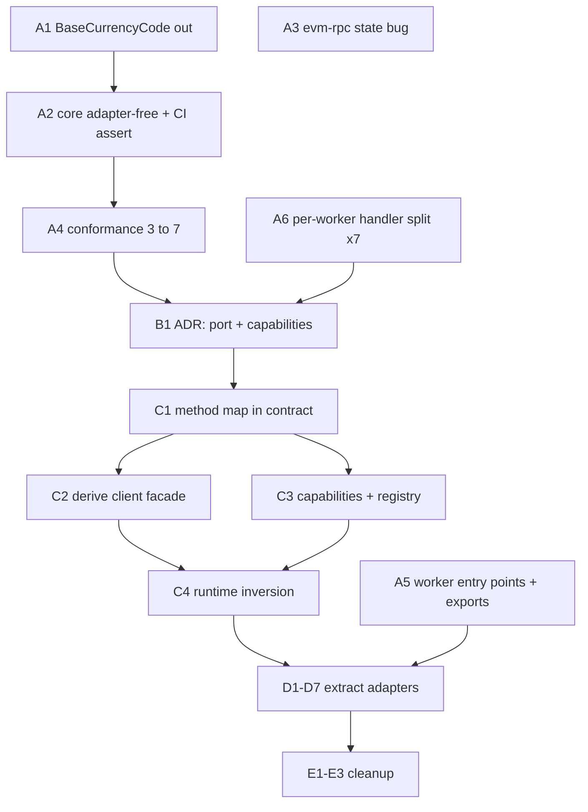

# blockchain-link modularization — PR plan

Working document for the `blockchain-link-modularization` effort. Delete once the migration is complete.

## Goal

Turn `@trezor/blockchain-link` from a monolith that contains every backend into:

- a **host** (client facade + worker runtime) with zero network dependencies,
- a **contract** (`@trezor/blockchain-link-types`) holding the port and domain model,
- **adapters** — one per backend — living either in `packages/` (multi-network) or `networks/<net>/` (single-network).

The user-visible outcome: **adding a network touches only `networks/<network>/`**.

### Target topology

```
packages/blockchain-link/                      host: client facade, worker runtime, state
packages/blockchain-link-types/                contract: port + domain model
packages/backend-blockbook/                    adapter, ~30 symbols (BTC-likes, EVM, TRX)

networks/bitcoin/network-bitcoin-backend/      electrum + utxo-lib, discovery
networks/ethereum/network-ethereum-backend/    evm-rpc + viem, staking, tokens
networks/cardano/network-cardano-backend/      blockfrost
networks/ripple/network-ripple-backend/
networks/solana/network-solana-backend/
networks/stellar/network-stellar-backend/
```

No `network-tron-backend` and no per-BTC-like packages — those networks are served entirely by
`backend-blockbook`. Create a network backend package only when that network has code of its own.

### Definition of done

- [ ] Adding a network touches only `networks/<network>/` (verified with a dry run)
- [ ] CI asserts the contract and host have zero `backend-*` / `network-*` dependencies
- [ ] Conformance suite green across all 7 backends
- [ ] `blockchain-link-types` under ~1,200 lines (from 2,947)
- [ ] A single-network build no longer pulls `viem` + `utxo-lib` + every network SDK

---

## Branch strategy

`develop` takes ~1,209 commits/month, and 74 commits touched `blockchain-link*` or `networks/` in the
last 60 days. Two previous attempts at this migration used a single long-lived branch and both died:

| Branch                           | Last commit | Behind develop |
| -------------------------------- | ----------- | -------------- |
| `origin/split-blockchain-link`   | 2026-03-14  | 5,072          |
| `origin/split-blockchain-link-2` | 2026-04-10  | 4,472          |

So: **only Phase C goes on `blockchain-link-modularization`.** Everything else targets `develop`
directly, because every other PR is non-breaking — the host keeps re-exporting, so consumers never
change in the same PR that moves code.

If a PR _can_ land on `develop`, it must.

### Rules while the integration branch is open

- Merge `develop` into the branch **daily**, automated.
- CI must be green on the branch itself, not only on PRs into it.
- Never edit a high-traffic file on the branch — make that change on `develop` first, then merge down.
- **Hard bound: 3 weeks.** If Phase C is not merged by then, split C1 out, land it alone, and
  re-decompose the rest. Both previous attempts had no bound and simply drifted.

---

## PR dependency graph



---

## Phase A — land on `develop` now

Non-breaking, independently valuable, no design decisions required. A1 goes first because it has the
largest conflict surface.

### A1 — Move `BaseCurrencyCode` out of `blockchain-link-types`

`src/baseCurrency.ts` (74 lines) is a list of fiat currency names (`usd: 'United States Dollar'`, …).
It is the **most-imported symbol in the package** — 69 uses, ~83 including its helpers — consumed by
`suite-common/formatters`, `trading`, `earn-stablecoin-api`, `suite-native/module-settings`,
`analytics`, and e2e page objects. It has no relation to blockchain backends.

- **Target:** a currency/fiat package (exact home TBD — see Open questions)
- **Acceptance:** `blockchain-link-types` no longer exports `BaseCurrencyCode`; ~85 files updated
- **Size:** large but mechanical
- **Why first:** every later PR that touches these files conflicts with it

### A2 — Make the core adapter-free and assert it

`src/index.ts:368` re-exports `sumAddressValues` from `./workers/electrum/methods/getAccountInfo` —
the **only** import from an adapter across `index.ts`, `baseWorker.ts`, `state.ts`, `utils.ts`,
`baseWebsocket.ts`. Its one external consumer is `packages/coinjoin/src/backend/getAccountInfo.ts:1`.

- Move `sumAddressValues` to `@trezor/blockchain-link-utils`; delete `index.ts:368`
- **Add the CI assertion:** core files import nothing from `src/workers/{blockbook,electrum,…}`
- **Acceptance:** the assertion exists and fails if reintroduced
- **Size:** ~4 files

### A3 — Fix evm-rpc module-level state

`src/workers/evm-rpc/handlers/subscribe.ts:7-8` holds `blockPollInterval` and `lastBlockHeight` at
module scope. Connect loads evm-rpc in _module_ context (`packages/connect/src/workers/workers.ts:35-39`
uses `import(…).then(w => w.default())`), so every EVM chain shares one module instance. Subscribing
on a second chain overwrites the first chain's interval handle (leaking that timer), unsubscribing on
either clears whichever is currently stored, and `lastBlockHeight` is compared across chains.

- Move both to per-instance state
- **Acceptance:** two concurrent EVM subscriptions poll independently; covered by a test
- **Size:** 1 file. Independent of everything else — can go first if convenient.

### A4 — Extend the conformance suite from 3 to 7 backends

`src/__fixtures__/allTestWorkers.ts` covers blockbook, ripple, blockfrost. Electrum, solana, stellar
and evm-rpc have only their own `*.integration.test.ts`.

- **Acceptance:** the shared suite (`src/*.test.ts`) runs against all 7 backends
- **Blocking:** this is the safety net for Phases C and D. No adapter moves before it exists.

### A5 — Worker entry points + `exports`

`connect` currently deep-imports `@trezor/blockchain-link/src/workers/blockbook`, bypassing any
package boundary, so every file move is a breaking change.

`origin/fix/blockchain-link-worker-exports` (Peter Sanderson, Jul 19) already solved the bundler
problem: stub files at `packages/blockchain-link/workers/<name>/index.ts` giving real filesystem
paths that webpack and Metro can resolve, plus `publishConfig.exports` subpaths for `lib`.

**That branch and its twin (`fix/blockchain-link-worker-entries`, Jul 27) both stalled. Find out why
before redoing the work** — it blocks all of Phase D.

- **Acceptance:** no `/src/` deep imports of `blockchain-link` remain in `connect` or `coinjoin`
- **Size:** ~15 files

### A6 — Per-worker `handlers/` + `subscriptions/` split

One PR per worker. Purely internal restructuring; does the mechanical work of extraction _before_ any
package boundary is drawn, so the Phase D move PRs become near-empty.

| Worker     | Status                                                                                 |
| ---------- | -------------------------------------------------------------------------------------- |
| blockfrost | **done** — `refactor/blockchain-link-blockfrost-split`, rebased clean, ready to PR     |
| blockbook  | partially done (worker class already lifted out of the entry point in the same branch) |
| ripple     | todo                                                                                   |
| stellar    | todo                                                                                   |
| solana     | todo                                                                                   |
| electrum   | already structured (`methods/`, `listeners/`) — verify only                            |
| evm-rpc    | already structured (`handlers/`) — verify only                                         |

Pattern to follow (from the blockfrost branch):

1. split the monolithic `index.ts` into `handlers/` + `subscriptions/`
2. lift the `XWorker` class out of `index.ts` into `xWorker.ts`, leaving the entry point thin

---

## Phase B — design, no code

### B1 — ADR: port and capability model

One reviewed document. No Phase C PR opens until it merges.

Must cover:

- the **method map** — a single declaration from which the adapter obligation (`CoreBackend`), the
  client surface, and the wire `Message`/`Response` unions are all derived. Today `GET_INFO` alone is
  declared in 4 places in the contract (`constants/messages.ts:5`, `constants/responses.ts:4`,
  `messages.ts:24`, `responses.ts:31`) plus the client facade plus 2 sites per adapter.
- **capability grouping** — which methods travel together (`fiatRates` is 3 methods supported by
  blockbook only; `utxo`, `balanceHistory`, `rawTx`, `blocks`, `rpc` are the others)
- **`BackendMap`** — the network-symbol-keyed type so most consumers never see an optional method
- **capabilities-as-data** for UI/selector gating, and how it is kept in sync with the implemented
  capabilities (proposal: assert equivalence in the conformance kit)
- the three open judgement calls: `WorkerState` ownership; failover as host policy vs composable
  transport; whether subscribe payload kinds (`mempool`, `fiatRates`) become capabilities

**Validate on paper against blockbook (17 methods, ~30 symbols, fiat rates + mempool) and solana
(6 methods)** — the two extremes. Design against the extremes; migrate starting from the easiest.

Current capability matrix, from the `onRequest` switches:

|                                                                                          | blockbook | blockfrost | electrum | evm-rpc | ripple | solana | stellar |
| ---------------------------------------------------------------------------------------- | --------- | ---------- | -------- | ------- | ------ | ------ | ------- |
| `getInfo`, `getAccountInfo`, `estimateFee`, `pushTransaction`, `subscribe`/`unsubscribe` | ✓         | ✓          | ✓        | ✓       | ✓      | ✓      | ✓       |
| `getBlockHash`                                                                           | ✓         | ✓          | ✓        | ✓       | –      | –      | –       |
| `getTransaction`                                                                         | ✓         | ✓          | ✓        | ✓       | ✓      | –      | –       |
| `getAccountUtxo`                                                                         | ✓         | ✓          | ✓        | –       | –      | –      | –       |
| `getAccountBalanceHistory`                                                               | ✓         | ✓          | ✓        | –       | –      | –      | –       |
| `getTransactionHex`                                                                      | ✓         | –          | ✓        | –       | –      | –      | –       |
| `getBlock`                                                                               | ✓         | –          | –        | ✓       | –      | –      | –       |
| `rpcCall`                                                                                | ✓         | –          | –        | ✓       | –      | –      | –       |
| fiat rates (×3)                                                                          | ✓         | –          | –        | –       | –      | –      | –       |
| `getContractInfo`                                                                        | ✓         | –          | –        | –       | –      | –      | –       |
| `validateEvmRpc`                                                                         | –         | –          | –        | ✓       | –      | –      | –       |

True core: **6 methods**. Everything else is a capability.

---

## Phase C — contract change (integration branch)

The only genuinely breaking part, and the only work that needs `blockchain-link-modularization`.
Merge to `develop` as one unit when green.

### C1 — Method map in the contract

Introduce the map; derive `Message` and `Response` unions from it. Removes the 4 parallel declaration
sites per method.

### C2 — Derive the client facade from the map

`BlockchainLink` methods generated from the same declaration rather than hand-written (`src/index.ts`
is currently ~20 near-identical `sendMessage` wrappers).

### C3 — Capability types + backend registry

Replace the hardcoded backend lists. There are **four** today:

1. `packages/connect/src/backend/Blockchain.ts:21` — `getWorker` switch
2. `packages/connect/src/workers/workers{,.browser,.native}.ts` — three parallel lists
   (note: `workers.native.ts` is missing `EvmRpcWorker` entirely)
3. `packages/blockchain-link/webpack/workers.web.js:6-13` — bundler entries
4. `suite-common/wallet-config/src/types.ts:25` (`TREZOR_CONNECT_BACKENDS`) plus per-network
   `backendOptions` in `networksConfig.ts`

The registry should mirror `suite-common/networks/src/createNetworksCompositionRoot.ts`. Item 4 is a
network→backend mapping that the network's own backend package should own.

### C4 — Runtime inversion

`BaseWorker` inheritance → `createWorkerRuntime({ handlers, connect, isConnected, dispose })`
composition. Extract the proxy-agent construction into an injected dependency — this removes the
`socks-proxy-agent` `browser`/`react-native` field overrides in `package.json` (currently labelled
`"__comment__": "Hotfix for issue where RN metro bundler resolve relatives paths wrong"`).

Also drop from the base class: the `setTimeout(…, 10)` handshake timing contract
(`baseWorker.ts:52`), the no-op `onmessage`/`onerror`/`onmessageerror` overridables (`:194-202`), and
the Sentry/TOR `proxyAgent.protocol` mutation (`:119-121`), which is a suite-desktop concern in a
generic base class.

---

## Phase D — extract adapters (back on `develop`)

One PR per adapter. With A5 and A6 done, each is a `git mv` plus a `package.json` plus a re-export
shim in `blockchain-link`, so no consumer changes in the same PR.

Order — easiest first:

| PR  | Adapter    | Target                                       | Notes                                           |
| --- | ---------- | -------------------------------------------- | ----------------------------------------------- |
| D1  | blockfrost | `networks/cardano/network-cardano-backend`   | already split; smallest                         |
| D2  | stellar    | `networks/stellar/network-stellar-backend`   | deps already in `network-stellar`               |
| D3  | ripple     | `networks/ripple/network-ripple-backend`     | deps already in `network-ripple`                |
| D4  | solana     | `networks/solana/network-solana-backend`     | deps already in `network-solana`                |
| D5  | electrum   | `networks/bitcoin/network-bitcoin-backend`   | takes `utxo-lib`, discovery, `sumAddressValues` |
| D6  | evm-rpc    | `networks/ethereum/network-ethereum-backend` | takes `viem`, staking, tokens                   |
| D7  | blockbook  | `packages/backend-blockbook`                 | last — biggest, ~30 symbols                     |

Each PR must:

- move the adapter, its wire types out of the contract, and its transforms
- keep a re-export shim in `blockchain-link`
- leave the conformance suite green

**Do not split the blockbook transforms per network.** `blockchain-link-utils/src/blockbook.ts`
(524 lines) branches on _Blockbook's response shape_, not on network — `tx.vin`/`vout` for UTXO
chains at `:225`, `tx.ethereumSpecific` at `:236`/`:256`/`:375`, Tron staking at `:186`. Splitting it
would be a rewrite with real regression risk. Blockbook stays one adapter serving many symbols.

Contract shrinkage as adapters leave:

| Moves out                           | Lines | With |
| ----------------------------------- | ----- | ---- |
| `blockbook-api.ts` + `blockbook.ts` | 1,263 | D7   |
| `blockfrost.ts`                     | 302   | D1   |
| `electrum.ts`                       | 172   | D5   |

Electrum's socket layer (`workers/electrum/sockets/{tcp,tls,tor}.ts`) stays a **folder** inside
`network-bitcoin-backend`. It is genuinely generic, but has exactly one consumer — promote it to a
package only when a second appears.

---

## Phase E — cleanup

### E1 — Split out the dev UI

`src/ui/*` (~1,200 lines; `config.ts` alone is 764 and duplicates coin/server config that already
lives in connect's coin data). Currently excluded at publish via `files: ["lib/", "!lib/ui"]`.

### E2 — Remove the re-export shims

Migrate remaining consumers to the adapter packages directly, then delete the shims.

### E3 — Docs and final assertions

- Add a `Backend` row to the technical-layers table in `networks/README.md`
- CI: contract has no `backend-*` / `network-*` dependency; host has no adapter dependency
- Note in the contract package README what does _not_ belong there

---

## Risks

| Risk                                          | Mitigation                                                                                 |
| --------------------------------------------- | ------------------------------------------------------------------------------------------ |
| Branch rot — **has already happened twice**   | Only Phase C on the branch; daily merges; hard 3-week bound                                |
| A5 stalls a third time                        | Diagnose the two dead `worker-exports` branches before reopening; it blocks all of Phase D |
| Blockbook transforms get split per network    | Explicitly out of scope — see Phase D                                                      |
| Contract package re-accumulates network types | CI dependency assertion, established in A2                                                 |
| Capability model doesn't fit blockbook        | B1 validates against blockbook + solana before any code is written                         |
| A1 conflicts with in-flight work              | Land it first, in one pass, and communicate the window                                     |

---

## Open questions

1. **Where does `BaseCurrencyCode` go?** Needs a home — a new `@trezor/currency` package, or an
   existing one under `suite-common/`. Blocks A1.
2. **Why did both `worker-exports` branches stall?** Blocks A5, which blocks Phase D.
3. **Is the worker/postMessage boundary still load-bearing?** `workers.browser.ts` already exempts
   solana and evm-rpc from `new Worker()`, and `workers.native.ts` uses module context throughout.
   If only two adapters genuinely need worker isolation, C4 gets substantially simpler.
4. **Is `@trezor/blockchain-link` still consumed outside this repo?** `files`/`publishConfig` say
   yes. Determines whether Phase E can break the API or must keep the facade permanently.
5. **Package rename `-types` → `-contract`?** Deferred. If done at all, bundle it with the D7
   breaking change so consumers migrate once.
