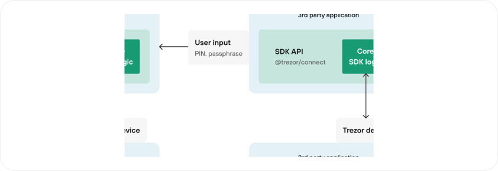
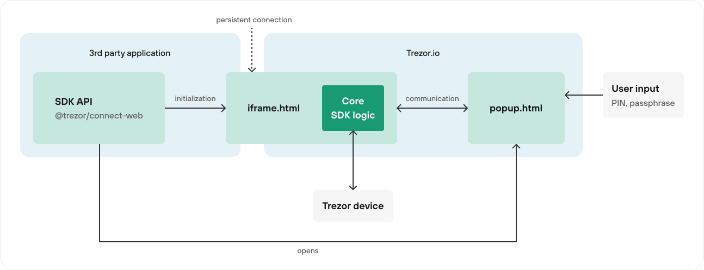

import { Cards, Card } from 'nextra/components';
import styled from 'styled-components';

import { spacingsPx } from '@trezor/theme';
import { Button, Card as TrezorCard, variables } from '@trezor/components';

import IconNode from '../components/icons/IconNode';
import IconWeb from '../components/icons/IconWeb';
import IconExtension from '../components/icons/IconExtension';

export const SectionCard = styled(TrezorCard)`
    margin-bottom: ${spacingsPx.xl};
`;

export const SdkHeading = styled.h2`
    display: flex;
    flex-direction: row;
    align-items: center;
    flex-wrap: wrap;
    gap: ${spacingsPx.sm};
    font-size: 1.5rem;
    font-weight: 600;
    margin-bottom: ${spacingsPx.sm};
`;

export const HiddenNextraHeading = styled.div`
    /* hidden heading for Nextra sidebar */
    visibility: hidden;
    height: 1px;
`;

export const SdkName = styled.div``;

export const SdkTag = styled.div`
    opacity: 0.5;

    @media (min-width: ${variables.SCREEN_SIZE.LG}) {
        flex: 1;
    }

`;

export const SdkContainer = styled.div`
    display: grid;
    grid-template-columns: 1fr;
    margin-top: ${spacingsPx.xxl};
    gap: ${spacingsPx.xxl};

    @media (min-width: ${variables.SCREEN_SIZE.LG}) {
        grid-template-columns: 2fr 1fr;
    }

`;

export const SdkDescription = styled.div``;

export const ExamplesAside = styled.div`
    p {
        margin-top: ${spacingsPx.xs};
    }
    ul {
        list-style-type: none;
        padding: 0;
        margin: 0;
    }
`;

export const ExampleHeading = styled.h3`
    font-size: 1rem;
    text-transform: uppercase;
    font-weight: 600;
    margin-bottom: 0;
`;

# Integrate Trezor devices with your project

<SectionCard>
    ### Explore Trezor Connect SDKs

    Trezor Connect is a tool for seamless integration of Trezor hardware wallet with third-party apps and extensions.
    Built with a developer-friendly interface, it ensures secure interactions for Trezor users within these apps.

    There are couple of options how to integrate Trezor devices with your project. This page walks
    you through installation and lets you explore SDK API.

    Depending on your environment you need to chose the right package.

    <Cards>
        <Card icon={<IconNode />} title="Node.js" href="#nodejs" />
        <Card icon={<IconWeb />} title="Web" href="#web" />
        <Card icon={<IconExtension />} title="Web extension" href="#web-extension" />
    </Cards>

</SectionCard>

<SectionCard>
    ### Quick start

    Import from your selected package

    ```javascript
    // in node
    import TrezorConnect from '@trezor/connect';
    // or in web based
    import TrezorConnect from '@trezor/connect-web';
    // or in webextension service worker
    import TrezorConnect from '@trezor/connect-webextension';
    ```

    Initialize in project

    ```javascript
    TrezorConnect.init({
        lazyLoad: true, // this param will prevent iframe injection until TrezorConnect.method will be called
        manifest: {
            email: 'developer@xyz.com',
            appUrl: 'http://your.application.com',
        },
    });
    ```

    Trezor Connect Manifest requires that you, as a Trezor Connect integrator, share your e-mail and application url with us.
    This provides us with the **ability to reach you in case of any required maintenance.**
    This subscription is mandatory. Trezor Connect raises an error that reads "Manifest not set" if manifest is not provided. It can be either set via `manifest` method or passed as a param in `init` method.

    ```javascript
    TrezorConnect.manifest({
        email: 'developer@xyz.com',
        appUrl: 'http://your.application.com',
    });
    ```

    If you need more customization, refer to [init method documentation](./methods/other/init)

</SectionCard>

<HiddenNextraHeading>

### Node.js

</HiddenNextraHeading>
<SectionCard>
    <SdkHeading className='nx-text-slate-900 dark:nx-text-slate-100'>
        <IconNode />
        <SdkName>Node.js</SdkName>
        <SdkTag></SdkTag>
        <Button 
            as="a" 
            variant="tertiary" 
            size="small" 
            icon="GITHUB" 
            href="https://github.com/trezor/trezor-suite/tree/develop/packages/connect"
            target="_blank">
            View on Github
        </Button>
    </SdkHeading>

    

    <SdkContainer>
        <SdkDescription>
            In Node.js the core SDK is loaded as a JavaScript module without any specificities.
        </SdkDescription>
        <ExamplesAside>
            <ExampleHeading>Examples:</ExampleHeading>
            - [node](https://github.com/trezor/trezor-suite/tree/develop/packages/connect-examples/node)
            - [electron in main layer](https://github.com/trezor/trezor-suite/tree/develop/packages/connect-examples/electron-main-process)
            - [Trezor Suite (desktop) electron app](https://github.com/trezor/trezor-suite/blob/develop/packages/suite-desktop/README.md)
        </ExamplesAside>
    </SdkContainer>

</SectionCard>

<HiddenNextraHeading>

### Web

</HiddenNextraHeading>
<SectionCard>
    <SdkHeading className='nx-text-slate-900 dark:nx-text-slate-100'>
        <IconWeb />
        <SdkName>Web</SdkName>
        <SdkTag>DOM required</SdkTag>
        <Button 
            as="a" 
            variant="tertiary" 
            size="small" 
            icon="GITHUB" 
            href="https://github.com/trezor/trezor-suite/tree/develop/packages/connect-web"
            target="_blank">
            View on Github
        </Button>
    </SdkHeading>

    

    <SdkContainer>
        <SdkDescription>
          `@trezor/connect-web` imports only a thin layer with API description into your 3rd party application. When initiated, it injects iframe containing core SDK logic from trezor.io
          into your app. User input, if needed, is served by popup.html page opened on trezor.io on behalf of your application. This way users input such as pin or passphrase is isolated from you and persistent connection between your app and core SDK is kept so events such as device connected/disconnected or blockchain subscriptions are available.
        </SdkDescription>
        <ExamplesAside>
            <ExampleHeading>Examples:</ExampleHeading>
            -   [web app](https://github.com/trezor/trezor-suite/tree/develop/packages/connect-examples/browser-inline-script)
            -   [web extension mv2 (foreground or background)](https://github.com/trezor/trezor-suite/tree/develop/packages/connect-examples/webextension-mv2)
            -   [web extension mv3 (foreground)](https://github.com/trezor/trezor-suite/tree/develop/packages/connect-examples/webextension-mv3)
            -   [electron in renderer layer with popup](https://github.com/trezor/trezor-suite/tree/develop/packages/connect-examples/electron-renderer-with-popup)
        </ExamplesAside>
    </SdkContainer>

</SectionCard>

<HiddenNextraHeading>

### Web extension

</HiddenNextraHeading>
<SectionCard>
    <SdkHeading className='nx-text-slate-900 dark:nx-text-slate-100'>
        <IconExtension />
        <SdkName>Web extension</SdkName>
        <SdkTag>Using service worker</SdkTag>
        <Button 
            as="a" 
            variant="tertiary" 
            size="small" 
            icon="GITHUB" 
            href="https://github.com/trezor/trezor-suite/tree/develop/packages/connect-webextension"
            target="_blank">
            View on Github
        </Button>
    </SdkHeading>

    

    <SdkContainer>
        <SdkDescription>
            In case of `@trezor/connect-webextension`, TrezorConnect object is created in a service worker.
            In this env we can't inject iframe so in order to uphold the same security model as with
            `@trezor/connect-web` we open popup.html and load core SDK logic into it. This however does not
            build persistent connection between SDK and 3rd party application meaning that events cannot be
            used.
        </SdkDescription>
        <ExamplesAside>
            <ExampleHeading>Examples:</ExampleHeading>
            - [web extension mv3 (background)](https://github.com/trezor/trezor-suite/tree/develop/packages/connect-examples/webextension-mv3-sw)
        </ExamplesAside>
    </SdkContainer>

</SectionCard>
