# Module trading

This module provides the core trading experience for users.

It includes the following screens:

- Trading tab in the bottom navigation bar
- Trading settings screen in settings
- Trading onboarding screen for new users
- Trading onboarding screen for existing users

## Modules

### @suite-native/module-trading

Main module providing buy, sell, and exchange flows.

### @suite-native/trading-history

Provides the trade history screen and all history-related components (trade list, trade detail sheet).

### @suite-native/trading-quote-utils

Shared trading utilities used by both `module-trading` and `trading-history` components.

### @suite-native/trading-provider-utils

Shared provider-aware UI components (`Footer`, `HowTradingWorksSheet`, `KycPolicyWarning`) used by both `module-trading` and `trading-history`.

### @suite-native/trading-state

Provides state management for trading features.

### @suite-native/trading-residence

Provides residence selection. Residence selection should be displayed on iOS only.

This module provides onboarding screens and settings screen for residence selection.

### @suite-native/transaction-management

Provides logic shared between trading and send flow.

### Internal trading modules

- **@suite-native/trading-analytics:** Analytics helpers.
- **@suite-native/trading-atoms:** Reusable components.
- **@suite-native/trading-browser-auth:** Hooks and components for handling browser authentication in trading features.
- **@suite-native/trading-debug:** Debug UI components for displaying information while `IsTradingDebugEnabled` FF is set.
- **@suite-native/trading-types:** Types used across trading modules.
- **@suite-native/trading-consts:** Constants used across trading modules.
- **@suite-native/trading-fixtures:** Fixtures for testing trading features.

```mermaid
graph TD
    subgraph non-trading-modules["External modules"]
        app["@suite-native/app"]
        module-onboarding["@suite-native/module-onboarding"]
        module-settings["@suite-native/module-settings"]
        state["@suite-native/state"]
        module-dev-utils["@suite-native/module-dev-utils"]
    end
    module-trading["@suite-native/module-trading"]
    trading-residence["@suite-native/trading-residence"]
    trading-state["@suite-native/trading-state"]
    subgraph trading-internal["Trading internal modules"]
        trading-history["@suite-native/trading-history"]
        trading-quote-utils["@suite-native/trading-quote-utils"]
        trading-provider-utils["@suite-native/trading-provider-utils"]
        trading-atoms["@suite-native/trading-atoms"]
        trading-analytics["@suite-native/trading-analytics"]
        trading-browser-auth["@suite-native/trading-browser-auth"]
        trading-debug["@suite-native/trading-debug"]
        trading-fixtures["@suite-native/trading-fixtures"]
        trading-types["@suite-native/trading-types"]
        trading-consts["@suite-native/trading-consts"]
    end
    subgraph shared["Shared modules"]
        transaction-management["@suite-native/transaction-management"]
    end

    app --> module-trading
    app --> state
    app --> module-settings
    app --> trading-residence
    app --> module-onboarding
    app --> module-dev-utils
    app --> trading-state
    module-dev-utils --> trading-state
    module-onboarding --> trading-residence
    module-onboarding --> trading-state
    state --> transaction-management
    state --> trading-state
    module-settings --> trading-state
    module-settings --> trading-residence
    module-trading -.-> trading-types
    module-trading --> trading-consts
    module-trading -.-> trading-fixtures
    module-trading --> trading-atoms
    module-trading --> trading-analytics
    module-trading --> trading-debug
    module-trading --> trading-browser-auth
    module-trading --> trading-quote-utils
    module-trading --> trading-provider-utils
    module-trading --> trading-history
    module-trading --> trading-state
    module-trading --> transaction-management
    module-trading --> trading-residence
    trading-history --> trading-browser-auth
    trading-history --> trading-quote-utils
    trading-history --> trading-provider-utils
    trading-history --> trading-atoms
    trading-history --> trading-state
    trading-quote-utils -.-> trading-fixtures
    trading-provider-utils -.-> trading-fixtures
    trading-provider-utils -.-> trading-types
    trading-provider-utils --> trading-state
    trading-browser-auth --> trading-analytics
    trading-browser-auth --> trading-debug
    trading-browser-auth --> trading-atoms
    trading-browser-auth --> trading-state
    trading-analytics --> trading-atoms
    trading-residence --> trading-state
    trading-residence --> trading-atoms
    trading-residence --> trading-consts
    trading-state --> trading-atoms
    trading-state -.-> trading-fixtures
    trading-state --> trading-consts
    trading-state -.-> trading-types
    trading-atoms -.-> trading-types
    trading-debug -.-> trading-types
    trading-debug -.-> trading-consts
    trading-debug --> trading-state
    trading-atoms -.-> trading-fixtures
    trading-fixtures --> trading-consts
    trading-fixtures -.-> trading-types
    trading-consts -.-> trading-types

    classDef outer fill: #6c757d, color: #fff, stroke: #495057
    classDef trading-root fill: #c61, stroke: #333, stroke-width: 2px
    classDef trading-group fill: #555, stroke: #333, color: #ddd
    class app,module-dev-utils,module-onboarding,module-settings,state outer
    class module-trading trading-root
    class trading-internal,shared trading-group
```

<!-- prettier-ignore-start -->

<!-- prettier-ignore-end -->
