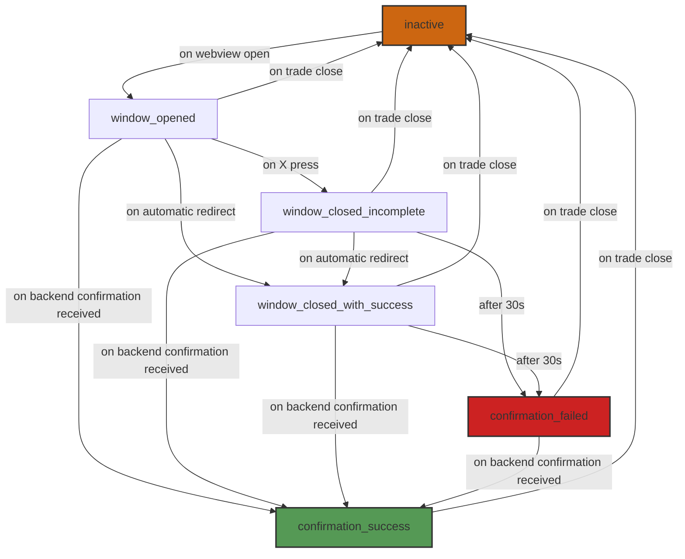

## Trading state

### Trading slice

#### providerConfirmationStatus state machine

<!-- prettier-ignore-start -->

```mermaid
graph TD
    inactive -- on webview open --> window_opened

    window_opened -- on trade close --> inactive
    window_opened -- on X press --> window_closed_incomplete
    window_opened -- on automatic redirect --> window_closed_with_success
    window_opened -- on backend confirmation received --> confirmation_success

    window_closed_incomplete -- on trade close --> inactive
    window_closed_incomplete -- on automatic redirect -->  window_closed_with_success
    window_closed_incomplete -- on backend confirmation received --> confirmation_success
    window_closed_incomplete -- after 30s --> confirmation_failed

    window_closed_with_success -- on backend confirmation received --> confirmation_success
    window_closed_with_success -- after 30s --> confirmation_failed
    window_closed_with_success -- on trade close --> inactive

    confirmation_failed -- on backend confirmation received --> confirmation_success
    confirmation_failed -- on trade close --> inactive

    confirmation_success -- on trade close --> inactive

    classDef initial-state fill: #c61, stroke: #333, stroke-width: 2px
    classDef fail-state fill: #c22, stroke: #333, stroke-width: 2px
    classDef success-state fill: #595, stroke: #333, stroke-width: 2px
    class inactive initial-state
    class confirmation_failed fail-state
    class confirmation_success success-state
```

<!-- prettier-ignore-end -->
