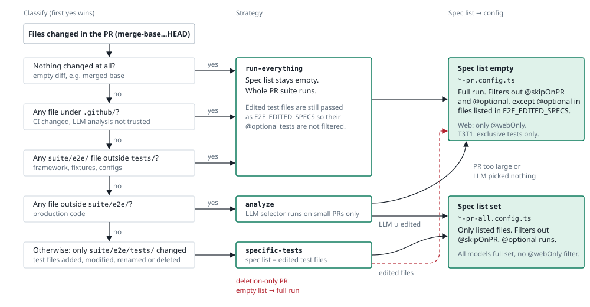

# E2E tests CI pipelines for Trezor Suite web and desktop

Let's have a look at how CI pipelines for E2E tests are set up.

## Test runner + reporting

We are using Playwright in combination with Currents.dev to run and orchestrate our E2E tests. All pipelines mentioned in this document have a desktop and web version. Their flows are identical, the only difference is which version of the app is tested.

### Features

- Currents reporting - Test reports and very useful statistics are available in https://app.currents.dev/
- Currents orchestration - Tests are running in parallel groups and the tests are dynamically distributed to these groups to optimize execution time.
- Configurable fail fast - If a given number of tests fails, all the parallel groups are terminated and the rest of the testing is skipped. This is used to save resources and time in case of heavily broken build.
- Test retries - The test runner is configured to perform up to two retries (i.e. maximum of 3 runs) to deal with test flakiness

### Note manual workflow reruns and orchestration

Due to the dynamic distribution of tests to the groups, we advise you to always use the option to rerun all jobs and never only the failed ones. That is because the orchestration would have less workers to run the tests and it would cause your test execution to be unnecessarily long.

#### When to use manual reruns

Use a manual rerun only when the run failed for reasons unrelated to the code, such as CI infrastructure. A new push always triggers a fresh run.

#### When to NEVER use manual reruns

You should never need to manually rerun tests, because you think the fail is caused by flakiness. This is already solved by the built-in retries and the fail is most likely real and will occur again in the rerun.

## Pull request pipeline

### Description and usage

This is the most commonly triggered pipeline, because it runs as part of each PR verification. It is optimized to run only the tests the change can affect.

### Triggers

- Open PR
- Push to PR

### Flow

The pipeline classifies the changed files, resolves a spec list from that, and picks the Playwright config from the spec list. Tag semantics are described in [e2e-playwright-suite.md](./e2e-playwright-suite.md).

#### 1. Classify the changed files

`.github/actions/determine-test-strategy`, first match wins:

| Changed files                                   | Strategy         |
| ----------------------------------------------- | ---------------- |
| Any file under `.github/`                       | `run-everything` |
| Any file under `suite/e2e/` outside `tests/`    | `run-everything` |
| Any file outside `suite/e2e/` (production code) | `analyze`        |
| Only files under `suite/e2e/tests/`             | `specific-tests` |

The action also outputs the test files the PR added, modified or renamed (`edited-specs`). Deleted files are dropped.

#### 2. Resolve the spec list

- `run-everything`: empty.
- `analyze`: the LLM test selector picks tests for PRs up to 1000 changed lines. Its picks are merged with `edited-specs`. Empty when the PR is larger or the selector picks nothing.
- `specific-tests`: `edited-specs`.

#### 3. Pick the config

- Empty spec list: `playwright-*-pr.config.ts`. Full run. `@nightlyOnly` and `@optional` are excluded, except `@optional` tests in files the PR edited (passed as `E2E_EDITED_SPECS`).
- Non-empty spec list: `playwright-*-pr-all.config.ts`. Only the listed files run. `@nightlyOnly` is excluded, `@optional` is not.

## Nightly and FW canary pipelines

### Description and usage

These pipelines are running nightly scheduled tests on develop branch. The FW canary is using firmware built from main branch to verify the latest build.

### Triggers

- Cron

### Test runner configuration

- Fail fast disabled

### Flow

The pipeline always runs all the tests with no additional logic.

## Release pipeline

### Description and usage

This pipeline serves as a release candidate verification.

### Triggers

- Push to release branch

### Test runner configuration

- Fail fast disabled

### Flow

The pipeline always runs all the tests with no additional logic.
